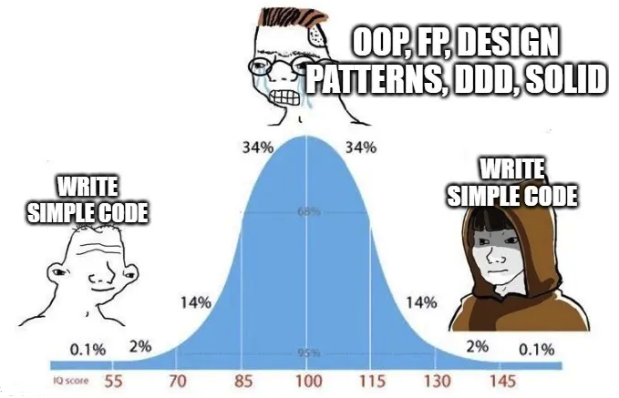

# Лабораторная работа 4. Чистый код: написание кода, понятного всем

## Содержание

+ [Что такое "Чистый код"?](#что-такое-чистый-код)
+ [Принципы написания кода](#принципы-написания-кода)
+ [SOLID](#solid)
+ [Чистый код на Python: руководство по применению](#чистый-код-на-python-руководство-по-применению)
+ [Запахи и антипаттерны](#запахи-и-антипаттерны)
+ [Критика методологии](#критика-методологии)
+ [Задание](#задание)

## Что такое "Чистый код"?

**"Чистый код"** - набор правил и принципов, помогающих сделать код читаемым, обслуживаемым и масштабируемым. Одноименная книга была опубликована в 2008 году **[Робертом Мартином](https://ru.wikipedia.org/wiki/%D0%9C%D0%B0%D1%80%D1%82%D0%B8%D0%BD,_%D0%A0%D0%BE%D0%B1%D0%B5%D1%80%D1%82_(%D0%B8%D0%BD%D0%B6%D0%B5%D0%BD%D0%B5%D1%80))**, более известный как **Дядюшка Боб (Uncle Bob)**, и с тех пор является бестселлером, а принципы чистого кода прочно вошли в практику IT-сообщества при разработке различного рода ПО.

Мартин описывает методологию "Чистого кода" как **школу мыслей**, для последователей которого описанные далее концепции, принципы и т.п. **являются беспрекословноей истиной, но не абсолютной**. У чистого кода как методологии есть множество недостатков, что делает ее не везде применимой, однако многие идеи можно принять как **вечные и прописные истины, которые программист обязан соблюдать**.

Ключевая цель чистого кода - **минимизация человеческих усилий, необходимые для создания и сопровождения системы**. Программисты тратят **больше** времени на чтение кода, чем на его написание. Учитывая это, правильное написание кода может сэкономить сотни часов на отладку, рефакторинг и запуск приложений и программ.

## Принципы написания кода

В рамках книги Мартин рассматривает множество тем, связанных с различными аспектами написания кода (именование, написание функций и комментариев, и т.п.), а также описывает многие принципы, которые в некоторой степени стали уже мемом в IT-коммьюнити: DRY, KISS, YAGNI, SoC, SOLID, и т.п.



### DRY (Don't Repeat Yourself) - Не повторяйся

Данная концепция была впервые сформулирована в книге Энди Ханта и Дэйва Томаса «Программист-прагматик: путь от подмастерья к мастеру», и звучит она следующим образом: **дублирование кода – пустая трата времени и ресурсов**; если есть код, который дублируется в нескольких местах, то следует выделить общую логику и обернуть в функцию. Повторное использование кода - всегда разумное решение.

### KISS (Keep It Simple, Stupid) - Будь проще

Данный принцип постулирует, что **простые системы будут работать лучше и надежнее**, не придумывайте более сложного решения, чем требуется. Написание производительного, эффективного и простого кода - наиболее разумное решение.

### YAGNI (You Ain't Gonna Need It) - Тебе это не понадобится

Идея заключается в следующем: **не реализовывайте функциональность, которая сейчас не нужна**. Более того, **закомментаренный код хуже кода плохого**, так как часто такой код отвлекает разработчика, а также привлекает ненужное внимание (нужно ли его добавлять потом, или как-то отрефакторить). В проекте должен присутствовать только рабочий код, лучше всего писать код так, чтобы в будущем его было легко модифицировать или отрефакторить.

### SoC (Separation of Concerns) - Разделение концепций

Идея состоит в том, что **программа должна быть разбита на непересекающиеся модули/секции, которые относятся к отдельной концепции**, т.е. код должен быть разбит таким образом, что каждая секция кода решала свою задачу, не пересекаясь с другим кодом. Отличный пример такого подхода - [MVC (Model-View-Controller)](https://ru.wikipedia.org/wiki/Model-View-Controller). Однако, важно не перебарщивать с разбиением на модули, так как больше модулей - больше потенциальных проблем или багов.

Наиболее важной аббревиатурой из всех по праву является только одна - **SOLID**.

## SOLID

**SOLID** - это аббревиатура из первых букв названий пяти принципов:

+ **Single Responsibility** - принцип единственной ответственности;
+ **Open/Closed** - принцип открытости/закрытости;
+ **Liskov Substitution** - принцип подстановки Барбары Лисков;
+ **Interface Segregation** - принцип разделения интерфейсов;
+ **Dependency Inversion** - принцип инверсии зависимостей;

Эти пять принципов являются базовыми при разработке, улучшая гибкость, масштабируемость и поддерживаемость ООП-кода.

### Single Responsibility

**Принцип единственной ответственности** постулирует, что **каждый объект, класс или метод должен иметь одну и только одну причину для изменений**. Это означает, что объект/класс/метод должен отвечать за свою функциональность, не должны существовать "функций/классов/методов бога", которые делают очень много действий, влияющих на всю систему.

Пусть есть класс для файлового менеджера, который умеет читать, записывать и работать с архивами.

```python
from pathlib import Path
from zipfile import ZipFile

class FileManager:
    def __init__(self, filename):
        self.path = Path(filename)

    def read(self, encoding="utf-8"):
        return self.path.read_text(encoding)

    def write(self, data, encoding="utf-8"):
        self.path.write_text(data, encoding)

    def compress(self):
        with ZipFile(self.path.with_suffix(".zip"), mode="w") as archive:
            archive.write(self.path)

    def decompress(self):
        with ZipFile(self.path.with_suffix(".zip"), mode="r") as archive:
            archive.extractall()
```

Класс нарушает принцип единой ответственности, так как обрабатывает больше одного типа файла. Отрефакторив этот класс согласно принципу, получатся следующие два класса:

```python
from pathlib import Path
from zipfile import ZipFile

class FileManager:
    def __init__(self, filename):
        self.path = Path(filename)

    def read(self, encoding="utf-8"):
        return self.path.read_text(encoding)

    def write(self, data, encoding="utf-8"):
        self.path.write_text(data, encoding)

class ZipFileManager:
    def __init__(self, filename):
        self.path = Path(filename)

    def compress(self):
        with ZipFile(self.path.with_suffix(".zip"), mode="w") as archive:
            archive.write(self.path)

    def decompress(self):
        with ZipFile(self.path.with_suffix(".zip"), mode="r") as archive:
            archive.extractall()
```

Теперь код становится более поддерживаемым, а также более контролируемым тестами.

### Open/Closed

**Принцип открытости/закрытости** постулирует, что **класс должен быть открыт для расширения, но закрыт для изменений.**, т.е. добавление новой функциональности не должно происходить через изменение существующего кода.

Пусть есть класс Shape

```python
import math

class Shape:
    def __init__(self, shape_type, **kwargs):
        self.shape_type = shape_type
        if self.shape_type == "rectangle":
            self.width = kwargs["width"]
            self.height = kwargs["height"]
        elif self.shape_type == "circle":
            self.radius = kwargs["radius"]

    def calculate_area(self):
        if self.shape_type == "rectangle":
            return self.width * self.height
        elif self.shape_type == "circle":
            return math.pi * self.radius**2
```

Данный класс очень плохо масштабируется, так как добавление новой фугуры потребует изменение существующих методов, что непрактично. Если выделить общую логику в отдельный класс, то добавление новой фигуры становится достаточно простым:

```python
from abc import ABC, abstractmethod
import math

class Shape(ABC):
    def __init__(self, shape_type):
        self.shape_type = shape_type

    @abstractmethod
    def calculate_area(self):
        pass

class Circle(Shape):
    def __init__(self, radius):
        super().__init__("circle")
        self.radius = radius

    def calculate_area(self):
        return math.pi * self.radius**2

class Rectangle(Shape):
    def __init__(self, width, height):
        super().__init__("rectangle")
        self.width = width
        self.height = height

    def calculate_area(self):
        return self.width * self.height

class Square(Shape):
    def __init__(self, side):
        super().__init__("square")
        self.side = side

    def calculate_area(self):
        return self.side**2
```

Здесь абстрактный класс фигуры определяет группу схожих объектов (поэтому и абстрактный класс, а не интерфейс), от которого наследуются все конкретные реализации.

### Liskov Substitution

**Принцип подстановки Барбары Лисков** говорит, что **код, использующий базовый тип, должен иметь возможность использовать подклассы, не зная об этом**.

Пусть есть класс Rectangle и класс-наследник Square (квадрат - прямоугольник с равными сторонами):

```python
class Rectangle:
    def __init__(self, width, height):
        self.width = width
        self.height = height

    def calculate_area(self):
        return self.width * self.height
class Square(Rectangle):
    def __init__(self, side):
        super().__init__(side, side)

    def __setattr__(self, key, value):
        super().__setattr__(key, value)
        if key in ("width", "height"):
            self.__dict__["width"] = value
            self.__dict__["height"] = value

class Square(Rectangle):
    def __init__(self, side):
        super().__init__(side, side)

    def __setattr__(self, key, value):
        super().__setattr__(key, value)
        if key in ("width", "height"):
            self.__dict__["width"] = value
            self.__dict__["height"] = value
```

Когда используется класс Square, то написанный код гарантирует, что квадрат будет одинаковой стороны. Но такая реализация нарушает принцип подстановки Лисков, так как класс Square нельзя использовать как Rectangle. Более того, реализация ломает интерфейс базового класса, меняя его поведение и потенциально приводя к нежелательным последствиям, например, при дебаггинге.

Чтобы исправить ситуацию, можно определить базовый класс, который может использоваться обоими классами:

```python
from abc import ABC, abstractmethod

class Shape(ABC):
    @abstractmethod
    def calculate_area(self):
        pass

class Rectangle(Shape):
    def __init__(self, width, height):
        self.width = width
        self.height = height

    def calculate_area(self):
        return self.width * self.height

class Square(Shape):
    def __init__(self, side):
        self.side = side

    def calculate_area(self):
        return self.side ** 2
```

При такой иерархии следующий код будет работать корректно:

```python
def get_total_area(shapes):
    return sum(shape.calculate_area() for shape in shapes)

print(get_total_area([Rectangle(10, 5), Square(5)]))
# output: 75
```

Из-за того, что функция учитывает только метод calculate_area базового класса, применение любого класса-наследника не убивает программу. В этом и состоит принцип подстановки Барбары Лисков.

### Interface Segregation

**Принцип разделения интерфейсов** говорит, что **не нужно заставлять клиента (класс) реализовывать интерфейс, который не имеет к нему отношения**. Это означает, что интерфейсы должны быть максимально маленькими таким образом, чтобы классы, их имплементирующие, не были вынуждены реализовывать ненужные методы.

Пусть есть абстрактный класс Printer и два класса-наследника:

```python
from abc import ABC, abstractmethod

class Printer(ABC):
    @abstractmethod
    def print(self, document):
        pass

    @abstractmethod
    def fax(self, document):
        pass

    @abstractmethod
    def scan(self, document):
        pass

class OldPrinter(Printer):
    def print(self, document):
        print(f"Printing {document} in black and white...")

    def fax(self, document):
        raise NotImplementedError("Fax functionality not supported")

    def scan(self, document):
        raise NotImplementedError("Scan functionality not supported")

class ModernPrinter(Printer):
    def print(self, document):
        print(f"Printing {document} in color...")

    def fax(self, document):
        print(f"Faxing {document}...")

    def scan(self, document):
        print(f"Scanning {document}...")
```

В данном примере Printer выступает как интерфейс для OldPrinter и ModernPrinter. Однако, OldPrinter **вынужден** имплементировать (фактически, делать заглушку) методы, которые ему не нужны.

Решением данной проблемы является декомпозиция базового класса на более мелкие интерфейсы таким образом, чтобы наследовались только нужные фичи:

```python
from abc import ABC, abstractmethod

class Printer(ABC):
    @abstractmethod
    def print(self, document):
        pass

class Fax(ABC):
    @abstractmethod
    def fax(self, document):
        pass

class Scanner(ABC):
    @abstractmethod
    def scan(self, document):
        pass

class OldPrinter(Printer):
    def print(self, document):
        print(f"Printing {document} in black and white...")

class NewPrinter(Printer, Fax, Scanner):
    def print(self, document):
        print(f"Printing {document} in color...")

    def fax(self, document):
        print(f"Faxing {document}...")

    def scan(self, document):
        print(f"Scanning {document}...")
```

Теперь для OldPrinter не требуется имплементация ненужных методов, позволяя создавать различные классы под конкретные задачи.

### Dependency Inversion

**Принцип инверсии зависимостей** говорит, что **абстракции не должны зависеть от деталей реализации, детали должны зависеть от абстракций**. Предположим, что создается приложение с двумя классами для визуализации данных пользователей (FrontEnd) и получения из БД данных (BackEnd) (в реальности это будет front-end и back-end слои приложения, но не суть):

```python
class FrontEnd:
    def __init__(self, back_end):
        self.back_end = back_end

    def display_data(self):
        data = self.back_end.get_data_from_database()
        print("Display data:", data)

class BackEnd:
    def get_data_from_database(self):
        return "Data from the database"
```

В данном примере FrontEnd зависит от BackEnd и его конкретной имплементации, что делает проблематичной масштабируемость. Например, в ситуации, когда разработчик хочет, чтобы данные читались через специальное API (например, REST API), требуется как модифицировать класс FrontEnd , так и класс BackEnd, так как они **жестко связаны (tight coupling)**, что помимо прочего нарушает принцип открытости-закрытости.

Чтобы решить данную проблему, требуется создать специальный класс, который будет выступать как абстракция (или интерфейс, в данном случае), с которой и будет работать FrontEnd:

```python
from abc import ABC, abstractmethod

class FrontEnd:
    def __init__(self, data_source):
        self.data_source = data_source

    def display_data(self):
        data = self.data_source.get_data()
        print("Display data:", data)

class DataSource(ABC):
    @abstractmethod
    def get_data(self):
        pass

class Database(DataSource):
    def get_data(self):
        return "Data from the database"

class API(DataSource):
    def get_data(self):
        return "Data from the API"
```

Теперь FrontEnd не зависит от деталей реализации источника данных, а также появляется возможность создавать имплементации под разные источники данных. При такой структуре следующий код будет работать корректно:

```python
db_front_end = FrontEnd(Database())
print(db_front_end.display_data())
# Output: Display data: Data from the database

api_front_end = FrontEnd(API())
print(api_front_end.display_data())
# Output: Display data: Data from the API
```

## Чистый код на Python: руководство по применению

Поскольку чистый код подразумевает следование некоторым стандартам, то обычно к практикам чистого кода добавляют правила оформления и написания кода под конкретный язык программирования (для Python - это PEP 8 и PEP 257), которые **обязаны** соблюдаться.

Далее будут описаны основные идеи, которые позволят сделать код более чистым (по Мартину, конечно).

### Имена, переменные

Серьезный выбор имен - первый шаг к чистому коду.

Важно соблюдать **правило мысленных преобразований**: не заставляйте читателя мысленно преобразовывать одни имена в другие, уже известные ему, т.е. при написании кода важно понимать **что большинство программистов/пользователей понимает под теми или иными именами**.

Имена должны быть **содержательными**, а также **передавать намерения разработчика**. Лучше использовать длинные, но хорошо описывающие имена, чем короткое и непонятное (даже если есть комментарии перед этим).

```python
# wrong:
# represents the number of active users
au = 55

# right:
active_user_amount = 55
```

Используйте **произносимые имена**: они лучше запоминаются и их проще использовать при объяснении.

```python
from datetime import datetime

# This is bad
genyyyymmddhhmmss = datetime.strptime('04/27/95 07:14:22', '%m/%d/%y %H:%M:%S')

# This is good
generation_datetime = datetime.strptime('04/27/95 07:14:22', '%m/%d/%y %H:%M:%S')
```

**Не используйте аббревиатуры**: лучше будет длинное, но понятное имя, чем странное.

```python
# This is bad
fna = 'Bob'
cre_tmstp = 1621535852

# This is good
first_name = 'Bob'
creation_timestamp = 1621535852
```

Старайтесь не использовать синонимы для именований

```python
# This is bad
client_first_name = 'Bob'
customer_last_name = 'Smith'

# This is good
client_first_name = 'Bob'
client_last_name = 'Smith'
```

**Не используйте магические числа**: мало того, что они не имеют четкого понимания, так еще усложняют понимание остального кода.

```python
import random

# This is bad
def roll():
    return random.randint(0, 36)  # what is 36 supposed to represent?

# This is good
ROULETTE_POCKET_COUNT = 36

def roll():
    return random.randint(0, ROULETTE_POCKET_COUNT)
```

Старайтесь использовать в названиях суффикс названия используемого типа данных, что делает более понятным контекст переменной и ее тип:

```python
# This is good
score_list = [12, 33, 14, 24]
word_dict = {
    'a': 'apple',
    'b': 'banana',
    'c': 'cherry',
}

# This is bad
names = ["Nick", "Mike", "John"]
```

Не добавляйте ненужный контекст в имена:

```python
# This is bad
class Person:
    def __init__(self, person_first_name, person_last_name, person_age):
        self.person_first_name = person_first_name
        self.person_last_name = person_last_name
        self.person_age = person_age


# This is good
class Person:
    def __init__(self, first_name, last_name, age):
        self.first_name = first_name
        self.last_name = last_name
        self.age = age
```

Не используйте глобальные переменные, кроме ситуаций, когда переменные - константы глобального уровня.

### Функции

Используйте глаголы для имен функций. Не применяйте синонимичные слова для одного и того же концепта:

```python
# This is bad
def get_name(): pass
def fetch_age(): pass

# This is good
def get_name(): pass
def get_age(): pass
```

Чем меньше и проще функция, тем она лучше. Функция должна выполнять только одну задачу (принцип единственной ответственности):

```python
# This is bad
def fetch_and_display_personnel():
    data = # ...

    for person in data:
        print(person)


# This is good
def fetch_personnel():
    return # ...

def display_personnel(data):
    for person in data:
        print(person)
```

Функции должны делать что-то одно и со стороны читателя понятное и **ожидаемое** (пример: метод-геттер должен возвращать значение поля, а не проводить преобразования): что очевидно разработчику, зачастую неочевидно остальным, поэтому код должен быть понятным для большинства.

Аргументов в функции должно быть минимальное количество: если их нужно много, то стоит подумать о создании класса, инкапсулирующего данные, для передачи в функции.

```python
# This is bad
def render_blog_post(title, author, created_timestamp, updated_timestamp, content):
    # ...

render_blog_post("Clean code", "Nik Tomazic", 1622148362, 1622148362, "...")


# This is good
class BlogPost:
    def __init__(self, title, author, created_timestamp, updated_timestamp, content):
        self.title = title
        self.author = author
        self.created_timestamp = created_timestamp
        self.updated_timestamp = updated_timestamp
        self.content = content

blog_post1 = BlogPost("Clean code", "Nik Tomazic", 1622148362, 1622148362, "...")

def render_blog_post(blog_post):
    # ...

render_blog_post(blog_post1)
```

Не используйте флаги в функциях без особой надобности.

```python
text = "This is a cool blog post."


# This is bad
def transform(text, uppercase):
    if uppercase:
        return text.upper()
    else:
        return text.lower()

uppercase_text = transform(text, True)
lowercase_text = transform(text, False)


# This is good
def uppercase(text):
    return text.upper()

def lowercase(text):
    return text.lower()

uppercase_text = uppercase(text)
lowercase_text = lowercase(text)
```

Однако, флаги позволяют создавать функциональность, которая может реиспользоваться в нескольких ситуациях. Например, функция sorted(), принимающая параметр reversed для определения порядка сортировки: ее разбиение на несколько функций только удвоит количество документации, а также создаст повторяющийся код.

Избегайте побочных результатов таких, как запись в файл или изменение глобальных переменных.

### Комментарии

Комментарии - неотъемлемая часть любого кода, которые позволяют объяснить намерения разработчика другим. Комментарии являются **дополнением к коду**, поэтому слишком много комментариев чаще всего только вносят дополнительные проблемы с читабельностью.

Не комментируйте плохой код наподобие `# TODO: RE-WRITE THIS TO BE BETTER`, ибо рано или поздно кто-то другой будет работать с этим, что приведет к большим тратам времени и сил, которые могли быть использованы для решения более важной задачи. Лучше переписать код, чем его закомментировать.

Если код **достаточно читабельный** (иногда говорят, что код **самодокументируемый**, т.е. код понятен без пояснений), то комментарии не нужны. Бесполезные комментарии только делают хуже, так как комментарии должны объяснять **почему** именно так реализовано, а не **как**.

```python
# Wrong:
# This checks if the user with the given ID doesn't exist.
if not User.objects.filter(id=user_id).exists():
    return Response({
        'detail': 'The user with this ID does not exist.',
    })

# Right:
if not User.objects.filter(id=user_id).exists():
    return Response({
        'detail': 'The user with this ID does not exist.',
    })
```

Комментарии должны быть полезными, добавление комментариев, которые скорее являются шумом, не должно происходить:

```python
numbers = [1, 2, 3, 4, 5]

# This variable stores the average of list of numbers.
average = sum(numbers) / len(numbers)
print(average)
```

Используйте корректные типы комментариев, исходя из выбранного языка программирования, изучите различные форматы документации, к примеру:

```python
def model_to_dict(instance, fields=None, exclude=None):
    """
    Returns a dict containing the data in ``instance`` suitable for passing as
    a Form's ``initial`` keyword argument.
    ``fields`` is an optional list of field names. If provided, return only the
    named.
    ``exclude`` is an optional list of field names. If provided, exclude the
    named from the returned dict, even if they are listed in the ``fields``
    argument.
    """
    opts = instance._meta
    data = {}
    for f in chain(opts.concrete_fields, opts.private_fields, opts.many_to_many):
        if not getattr(f, 'editable', False):
            continue
        if fields is not None and f.name not in fields:
            continue
        if exclude and f.name in exclude:
            continue
        data[f.name] = f.value_from_object(instance)
    return data
```

Никогда не оставляйте в файлах закомментированный код: это самое плохое, что может быть в коде, так как непонятно для чего его закомментировали. Перед фиксацией изменений в системе контроля версий обязательно удалите подобное.

### Отлавливание ошибок

Код подразумевает также работу с исключениями, поэтому в чистом коде должны присутствовать операторы проверки, чтобы программа не просто падала, но и еще обрабатывала исключение и выдавала содержательное сообщение.

### Специфичные инструменты для Python

**Декораторы** - чрезвычайно мощный инструмент, который позволяет добавлять новую функциональность к уже существующему коду, работая похожим с замыканием образом. Декораторы являются прекрасными примерами принципа SoC, делая код более модуляризированным и гибким. Например, реализация проверки пароля при обращении можно реализовать через декоратор:

```python
def ask_for_passcode(func):
    def inner():
        print('What is the passcode?')
        passcode = input()

        if passcode != '1234':
            print('Wrong passcode.')
        else:
            print('Access granted.')
            func()

    return inner


@ask_for_passcode
def start():
    print("Server has been started.")


@ask_for_passcode
def end():
    print("Server has been stopped.")


start()  # decorator will ask for password
end()  # decorator will ask for password
Our server will now ask for a password every time start() or end() is called.
```

**Менеджеры контекста** - операторы, которые позволяют создавать и уничтожать ресурсы корректно, обеспечивая безопасное выполнение кода. Чаще всего менеджеры используют при открытии файлов, соединений с БД, замками при многопоточном программировании, работе с сетевыми сокетам, и т.п. Выглядит это следующим образом:

```python
with open("file.txt", "r") as file:
    content = file.read()
    print(content)
```

Без менеджера контекста код выглядел бы следующим образом:

```python
file = open("file.txt", "r")
try:
    # Действия с файлом
    content = file.read()
    print(content)
finally:
    file.close()
```

**Итераторы** - объекты, которые задают правило перебора для некоторой коллекции конечного числа элементов. Итераторы предпочтительнее при обходе коллекций, чем индексирование, хотя следующий код идентичен:

```python
names = ["Mike", "John", "Steve"]
names_iterator = iter(names)

for i in range(len(names)):
    print(next(names_iterator))

for name in names:
    print(name)
```

**Генераторы** - функции, которые возвращают итераторы через оператор `yield`, запоминая свое состояние (по своей сути, они работают как замыкания)каждое следующее значение получается с помощью вызова `next(generator)`:

```python
def multiple_generator(x, n):
    for i in range(1, n + 1):
        yield x * i

multiples_of_5 = multiple_generator(5, 3)
print(next(multiples_of_5))  # 5
print(next(multiples_of_5))  # 10
print(next(multiples_of_5))  # 15
```

## Критика методологии

Несмотря на свою несомненную пользу в области разработки ПО, вокруг чистого кода возник некоторый культ, который пытается внести чистый код во все сферы разработки, при этом порождая кучу вредных мифов ("нежелательность аргументов-флагов", "не более одной команды try", "глобальные переменные не нужны", и т.п.).

Более того, у некоторых программистов к самой концепции чистого кода и дядюшке Бобу есть определенного рода претензии: абсолютизация того, что "проповедует" школа чистого кода, и проникание во все отрасли приводит к проблемам.

К примеру, в книге приведен пример кода для генерации простых чисел, который Роберт Мартин называет правильным и чистым (примеры на Java, однако, суть одна):

```java
public class PrimeGenerator {
    private static int[] primes;
    private static int[] multiplesOfPrimeFactors;

    protected static int[] generate(int n) {
        primes = new int[n];
        multiplesOfPrimeFactors = new int[n];
        set2AsFirstPrime();
        checkOddNumbersForSubsequentPrimes();
        return primes;
    }

    private static void set2AsFirstPrime() {
        primes[0] = 2;
        multiplesOfPrimeFactors[0] = 2;
    }

    private static void checkOddNumbersForSubsequentPrimes() {
        int primeIndex = 1;
        for (int candidate = 3; primeIndex < primes.length; candidate += 2) {
            if (isPrime(candidate)) {
                primes[primeIndex++] = candidate;
            }
        }
    }

    private static boolean isPrime(int candidate) {
        if (isLeastRelevantMultipleOfNextLargerPrimeFactor(candidate)) {
            multiplesOfPrimeFactors[multiplesOfPrimeFactors.length - 1] = candidate;
            return false;
        }
        return isNotMultipleOfAnyPreviousPrimeFactor(candidate);
    }

    private static boolean isLeastRelevantMultipleOfNextLargerPrimeFactor(int candidate) {
        int nextLargerPrimeFactor = primes[multiplesOfPrimeFactors.length];
        int leastRelevantMultiple = nextLargerPrimeFactor * nextLargerPrimeFactor;
        return candidate == leastRelevantMultiple;
    }

    private static boolean isNotMultipleOfAnyPreviousPrimeFactor(int candidate) {
        for (int n = 1; n < multiplesOfPrimeFactors.length; n++) {
            if (isMultipleOfNthPrimeFactor(candidate, n)) {
                return false;
            }
        }
        return true;
    }

    private static boolean isMultipleOfNthPrimeFactor(int candidate, int n) {
        return candidate == smallestOddNthMultipleNotLessThanCandidate(candidate, n);
    }

    private static int smallestOddNthMultipleNotLessThanCandidate(int candidate, int n) {
        int multiple = multiplesOfPrimeFactors[n];
        while (multiple < candidate) {
            multiple += 2 * primes[n];
        }
        multiplesOfPrimeFactors[n] = multiple;
        return multiple;
    }
}
```

А теперь реализуем код более простым способом:

```java
public static List<Integer> generatePrimes(int count) {
    List<Integer> primes = new ArrayList<>();
    int primeCandidate = 2;

    while (primes.size() != count) {
        boolean candidateIsPrime = true;
        for (int i = 2; i <= Math.sqrt(primeCandidate); i++) {
            if (primeCandidate % i == 0) {
                candidateIsPrime = false;
                break;
            }
        }

        if (candidateIsPrime) {
            primes.add(primeCandidate);
        }
        primeCandidate += 1;
    }

    return primes;
}
```

Как можно убедиться, код Мартина **в разы сложнее в понимании**, искуственно усложнен, что, естественно, бессмысленно. Во втором примере присутствует понятная обработка диапазона поиска простых чисел, код атомарен и не размазан по нескольким функциям, и что более важно - **легко рефакторится**.

Возьмем другой пример (тоже на Java, вся книга на ней написана, проще показать примеры на том же языке, а не переписывать) - тест для устройства управления окружающей среды. Не вдаваясь в детали, тест проверяет, что при низкой температуре контроллер отправляет оповещение:

```java
@Test
public void turnOnLoTempAlarmAtThreashold() throws Exception {
    hw.setTemp(WAY_TOO_COLD);

    controller.tic();

    assertTrue(hw.heaterState());
    assertTrue(hw.blowerState());
    assertFalse(hw.coolerState());
    assertFalse(hw.hiTempAlarm());
    assertTrue(hw.loTempAlarm());
}
```

Код достаточно простой и понятен, максимум, что может вызвать разночтения - это стиль (название функций/методов, порядок assert-ов, и т.п). Мартин переписал тест следующим образом:

```java
@Test
public void turnOnLoTempAlarmAtThreshold() throws Exception {
    wayTooCold();
    assertEquals("HBchL", hw.getState());
}
```

С одной стороны, теперь не нужно задумываться о смысле метода tic, установке температуры. с другой - что делает функция wayTooCold() (и почему название функции не содержит глагол)? Что означают буквы в assert-е и как они соотносятся с состоянием? Почему понятные на уровне "палка-веревка" 5 assert-ов в первом тесте хуже, чем 1 во втором? Явных объяснений почему Мартин не дает (Мартин сам признает, что тут *почти* нарушается правило о мысленных преобразованиях).

Исходя из приведенных примеров, некоторые критики описывают методологию Мартина как смешение **прописных истин, не поддающихся сомнению** (все вышеописанное до критики примерно из такого разряда) и **сомнительных практик и идей**. В зависимости от языка программирования меняется стиль программирования, поэтому многие принципы попросту не применимы (как в языках типа Си или Lisp применить ООП? Или в Go, где не работает наследование в терминах SOLID?).

Однако здесь заключается ключевое непонимания идей, которые продвигает Мартин. В книге дядюшка Боб показывает (или, по крайней мере, старается) **по какой причине применяется та или иная концепция**, и что эти принципы вырабатывались на практических задачах. Если пытаться применять идеи **неосознанно**, то естественным образом будут возникать проблемы, как показано в предыдущих примерах.

Поэтому, ключевое в применении концепций чистого кода - **понимать суть идей, и уметь адаптировать их для своего проекта**, держа в голове, что не все принципы применимы и не везде. **Чистый код - это в первую очередь про дисциплину и осознанность, не про фанатизм**.

## Задание

Реализуйте простую архитектуру (не полноценное приложение), исходя из варианта.

**Требования**:

1. Все варианты* должны реализовываться с применением принципов Чистого кода и в рамках ООП. Приветствуется использование паттернов ООП.
2. Для проверки жизнеспособности кода реализовать набор тестов к коду и пример использования кода (программу-движок, где используется архитектура).
3. В качестве итогового результата - набор скриптов (файлов с расширением .py).

### Варианты

1. **Библиотека**: реализуйте программу **библиотеки**, поддерживающее добавление, удаление и обновление информации о книгах и их авторах, ис
2. **Интернет-магазин (облегченная версия)**: постройте архитектуру интернет-магазина, включающего корзину покупок, каталог товаров и систему оплачивания.
3. **Управление сотрудниками**: создайте систему управления сотрудниками, включая назначение задач, расчёт зарплаты и хранение информации о сотрудниках.
4. **Бронирование билетов**: разработайте систему бронирования билетов для кинотеатра с возможностью выбора фильмов, времени сеансов и бронирования мест.
5. **Управление проектами**: разработайте систему управления проектами, которая включает создание задач, обновление статусов и оценку времени выполнения.
6. **Управление складом**: создайте систему управления складом с учётом поступления и расходования товаров. Разделите логику на несколько компонентов для учёта поступлений, списания и отчётности.
7. **Система учёта студентов**: разработайте систему учёта студентов с регистрацией на курсы, оценками и посещаемостью. Обеспечьте возможность добавления новых курсов и студентов.
8. **Мессенджер**: разработайте систему чата с поддержкой отправки сообщений, онлайн-статуса пользователей, реакций на сообщение.
9. **Управление рестораном**: постройте систему управления рестораном, включая заказы, меню и расчёт суммы заказа.
10. **Обработка платежей**: разработайте систему обработки платежей с поддержкой различных способов оплаты, таких как кредитные карты и электронные кошельки.
