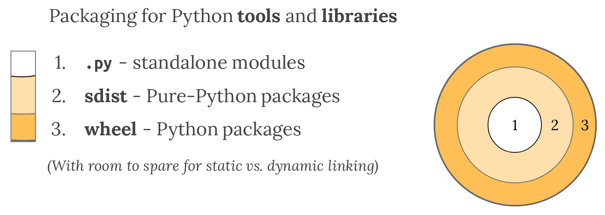

# Пакеты и приложения в языке Python: структура, сборка, распространение

Как мультипарадигменный язык программирования, Python разрабатывается для использования в разных сферах, например, для разработки моделей ИИ, игр или веб-сайтов. Гибкость Python - причина, почему, в первую очередь, перед непосредственной разработкой необходимо озаботиться вопросом структуры проекта, соответствующего окружения, где проект работает, чтобы предотвратить появление проблем при создании и использовании.

## Содержание

- [Пакеты и приложения в языке Python: структура, сборка, распространение](#пакеты-и-приложения-в-языке-python-структура-сборка-распространение)
  - [Содержание](#содержание)
  - [Что такое пакет в Python?](#что-такое-пакет-в-python)
  - [Структура пакетов](#структура-пакетов)
    - [Документация](#документация)
    - [Файлы исходного кода](#файлы-исходного-кода)
    - [Сборка пакета: pyproject.toml и setup.py](#сборка-пакета-pyprojecttoml-и-setuppy)
  - [Модули и файлы \_\_init\_\_.py](#модули-и-файлы-__init__py)
  - [Установка пакета из локального репозитория](#установка-пакета-из-локального-репозитория)
  - [TestPyPI: песочница для разработчиков пакетов](#testpypi-песочница-для-разработчиков-пакетов)
  - [Ссылки](#ссылки)

## Что такое пакет в Python?

**Пакеты** в Python - ключевой элемент языка, определяющий путь повторного использования и распространения кода **и для библиотек, и для приложений**.

Обычно они загружаются через специальные утилиты - `pip` (официальный менеджер пакетов) и `conda` (менеджер виртуальных сред, а также их пакетов). К примеру, когда вы делаете команду `pip install numpy` (или `conda install numpy` в активной виртуальной среде), менеджер ищет в специальном хранилище (в случае conda - в **каналах**, которые почти идентичны)- **[Python Packaging Index (PyPI)](https://pypi.org/)** - где размещаются **дистрибутивы** программных проектов. Однако, менеджеры поддерживают установку из сторонних источников, в частности, через указание URL, откуда можно скачать дистрибутив пакета. Например, установка пакета PyTorch осуществляется следующим образом:

```bash
pip install torch --index-url https://download.pytorch.org/whl/cu126
```

Как выглядит дистрибутив пакета для библиотеки? Обычно он состоит из 3 частей:

1. **Файлы модулей**: они имеют расширение .py и зависят **только** от стандартной библиотеки. Единственное, о чем требуется думать - версия языка, на котором написан код.
2. **Файлы дистрибутива исходников**. В проектах код состоит из множества файлов .py, находящихся в некоторой иерархии или структуре, и имеет зависимости от библиотек и их конкретных версий. Через встроенные инструменты языка можно объединить код и его зависимости в **дистрибутивный пакет исходников (Source Distribution Package)**, или **sdist**. Питоновские sdist - это **сжатый архив .tar.gz**, который содержит **только Python-код**.
3. **Файлы бинарного дистрибутива**. Ключ к популярности Python состоит в возможности интеграции с окружающей экосистемой и ПО, написанном на таких языках, как C, C++, Fortran, Rust и т.д. Так, например, пакет Numpy опирается на библиотеку BLAS, написанную на языке Fortran. Поскольку не у всех разработчиков есть инструменты для сборки этих компонентов (компиляторы, библиотеки и т.п.), Python придумал специальный формат диструтива - **wheel** - идеей которого является **связать** код на Python и скомпилированные артифакты (бинарные файлы, скомпилированные библиотеки, и т.п.). Обычно wheel публикуют вместе с sdist (если есть возможность), поскольку в этом случае sdist будет содержать **не только Python-код, но и код другого языка**, который можно собрать собственными руками, чтобы была во работать с кодом на разных платформах. Python и PyPI поддерживают оба формата вместе.



Дистрибутивы для приложения обычно зависят от конкретных фреймворков и платформ, которые используются, поэтому сборка подобного дистрибутива будет зависеть от них (точнее, гайд по сборке будет свой).

Однако, довольно часто необходимо здать для проекта **исполняемый файл (executable file - .exe для Windows)**, которые можно выполнять в отрыве от среды как единый файл, инкапсулируя в него интерпретатор Python, зависимости и код приложения. Такой подход называется **freezing**. Делать в случае установки *для одного пользователя* это можно через следующие инструменты:

- [pyInstaller](https://pyinstaller.readthedocs.io/en/stable/) - кросс-платформенный
- [cx_Freeze](https://marcelotduarte.github.io/cx_Freeze/) - кросс-платформенный
- [constructor](https://github.com/conda/constructor) - для установки через консоль
- [py2exe](http://www.py2exe.org/) - только Windows
- [py2app](https://py2app.readthedocs.io/en/latest/) - только MacOS
- [osnap](https://github.com/jamesabel/osnap) - Windows и Mac
- [pynsist](https://pypi.org/project/pynsist/) - только Windows

Далее будет рассматриваться структура пакета на примере библиотек, однако, общая структура также имеет место в случае приложений.

[К оглавлению](#содержание)

## Структура пакетов

Ниже приведен шаблон структуры пакета, который обычно применяется при создании:

```text
package-demo
├── CHANGELOG.md               ┐
├── CONDUCT.md                 │
├── CONTRIBUTING.md            │
├── docs                       │
│   ├── changelog.md           │
│   ├── conduct.md             │
│   ├── conf.py                │ 
│   ├── contributing.md        │ Package documentation
│   ├── example.ipynb          │
│   ├── index.md               │
│   ├── make.bat               │
│   ├── Makefile               │
│   └── requirements.txt       │
├── LICENSE                    │
├── README.md                  ┘
├── pyproject.toml             ┐ 
├── src                        │
│   └── package-demo           │ Package source code, metadata,
│       ├── __init__.py        │ and build instructions 
│       ├── moduleA.py         │
│       └── moduleB.py         ┘
└── tests                      ┐
    └── test_demo.py           ┘ Package tests
```

Структура пакетов выглядит следующим образом:

### Документация

К документации относится следующее:

|Документация|Местоположение (по умолчанию)|Описание|
|:---    | :--- | :---      |
|README|Корень проекта|Предоставляет информацию о пакете, например, как установить, или как использовать.|
|LICENSE|Корень проекта|Определяет права на интеллектуальную собственность и правила использования и дистрибуции.|
|Contributing guidelines|Корень проекта|Объясняет правила, как можно сделать вклад в проект|
|Code of conduct|Корень проекта|Определяет стандарты как корректно участвовать в развитии проекта|
|Changelog|Корень проекта|Хронологически упорядоченный список записанных изменений в пакете с течением времени, обычно организовывая по версиям|
|Docstrings|*.py* файлы |Текст, который находится в первых строках функции, метода, класса или модуля Python, описывающий что делает код и как его использовать. Доступен через вызов команды `help()`.|
|Примеры|папка *`docs/`* |Пошаговые примеры, показывающие как работает пакет в деталях.|
|Описание прикладного программного интерфейса (API)|папка *`docs/`* | Упорядоченный список с описанием функциональности пакета (функций, классов, и т.п.) вместе с коротким описанием того, что код делает и как его использовать. Обычно генерируется автоматически из docstrings через автогенераторы документации, например, [Sphinx](https://www.sphinx-doc.org/en/master/)|

Обычно порядок создания документации выглядит так:

1. **Написать документацию** в коде или в формате отдельных файлов.
2. **Собрать документацию**: скомпилировать и отрендерить в HTML через автогенератор
3. **Разместить документацию** на специально выделенном сайте.

Более подробно про то, как делать документацию, можно почитать [здесь](https://py-pkgs.org/03-how-to-package-a-python#writing-documentation).

### Файлы исходного кода

### Сборка пакета: pyproject.toml и setup.py

При сборке пакета утилиты *предполагают*, что данные о том, как собирать, находятся в специальном файле или файлах. Такими файлами в мире Python являются конфигурационные файлы **pyproject.toml** и **setup.py**.

**pyproject.toml** - конфигурационный файл в формате *.toml*, который содержит **метаданные** пакета в формате таблиц.

К метаданным относятся:

1. **Метаданные проекта**: данные о проекте (название, версия, ссылки на файлы документации и на ресурсы проекта, и т.п.), которые находятся в таблице [project].
2. **Зависимости проекта**: пакеты, библиотеки, или фреймворки, которые должны быть установлены в среду при сборке пакета. Поддерживается указание версий пакетов, как это обычно выглядит в файлах *requirements.txt*. Информация хранится в таблице [project], в поле *dependencies* (а также в поле *requires-python*, где указываются требования к версии интерпретатора).
3. **Зависимости системы сборки**: специальная таблица, в которым указывается система сборки, а также требования для нее (обычно - наличие пакета сборщика) За эту информацию отвечает таблица [build-system].
4. **Параметры дополнительных инструментов**: через таблицы [tool.*], где \* - название инструмента, можно конфигурировать различные утилиты или программы, которые могут запускаться для проектов. Например, для pytest можно указать аргументы, которые будут применяться при каждом запуске.

Самая базовая структура будет выглядеть примерно следующим образом:

```python
[project]
name = "package-demo"
version = "0.1.0"
description = ""
authors = [
    {name = "Andrey Budnikov"}
]
readme = "README.md"
requires-python = ">=3.12"
dependencies = [
]

[tool.poetry]
packages = [{include = "package_demo", from = "src"}]


[build-system]
requires = ["poetry-core>=2.0.0,<3.0.0"]
build-backend = "poetry.core.masonry.api"
```

Здесь в качестве системы сборки используется **[Poetry](https://python-poetry.org/)**, который может выступать как продвинутый менеджер виртуальной среды, гарантирующий совместимость пакетов в проекте.

Более подробно про структуру pyproject.toml можно прочитать [здесь](https://packaging.python.org/en/latest/guides/writing-pyproject-toml/).

**setup.py** - конфигурационный файл, который является скриптом сборки пакета. Несмотря на пока еще продолжающуюся поддержку этого формата конфигурации, для **чисто питоновских проектов** рекомендуется использовать только *pyproject.toml*. Единственное исключение - **сборка пакетов с наличием не-Python кода** (например, языки C, C++ или Fortran). Это объясняется тем, что для соединения между кодом на Python и на другом языке (иначе говоря, для **биндинга (binding)**) требуется переопределять способ сборки. Так, для C/C++ в некоторых реализациях биндинга требуется определить специальный [класс](https://github.com/pybind/cmake_example/blob/master/setup.py), который взаимодействует с инструментом сборки С/С++ кода **CMake**, что невозможно сделать через *pyproject.toml*.

[К оглавлению](#содержание)

## Модули и файлы \_\_init\_\_.py

**Модули** - это основа любого пакета: по своей сути, модулями являются **все** файлы с расширением *.py*. Однако, для *создания* пакета, а также иерархии модулей, которые доступны через оператор `import ...`, требуется определить специальный файл, название которого содержит  **dunder-нотацию** (такую нотацию имеют специальные методы класса, которые, например, переопределяют операции - \_\_add\_\_, \_\_mul\_\_, и т.п., делают строковое представление объекта - \_\_str\_\_, \_\_repr\_\_, и т.п.) - \_\_init\_\_.py.

Как он выглядит? В общем случае - это *пустой файл*. Он нужен лишь для того, чтобы интерпретатор понимал папку с файлами *.py* как пакет. Однако, через этот файл можно управлять процессом импортирования. Например, чтобы сделать доступным при импорте пакета какую-то функцию, *минуя модуль*, можно сделать следующий файл в корне пакета:

```python
# __init__.py
from .moduleA import some_stuff
```

Важно: поскольку оператор `import` (и `from` тоже) будет понимать название как *установленный пакет/модуль*, то при импорте через `from moduleA ...` интерпретатор будет пытаться найти нужное в пакетах, установленных в системе, и, соответственно, выдаст ошибку. Однако, в случае \_\_init\_\_.py такие проблемы можно решить через **относительный импорт** - импорт с точкой перед именем необходимого модуля или подпакета. При таком типе импорта интерпретатор будет сначала смотреть локальные файлы модулей, а только потом установленные пакеты.

[К оглавлению](#содержание)

## Установка пакета из локального репозитория

В случае, если вы хотите установить пакет из локального репозитория, а не из PyPI, вы можете использовать команду `pip install` с указанием пути к директории, где находится ваш пакет. Например:

```bash
pip install /path/to/your/package
```

Здесь pip будет искать файл `setup.py` или `pyproject.toml` в указанной директории и установит пакет, используя информацию из этих файлов. Если файлов нет, то pip выдаст ошибку.

Если вы хотите установить пакет из локального репозитория, но не хотите, чтобы он был доступен для всех пользователей системы, вы можете использовать флаг `--user`, который установит пакет только для текущего пользователя (фактически, в терминах Unix-подобных систем, в директорию `~/.local/lib/pythonX.Y/site-packages`, где X.Y - версия Python). Например:

```bash
pip install --user /path/to/your/package
```

Если пакет уже установлен, но вы хотите переустановить его, вы можете использовать флаг `--force-reinstall`, который заставит pip переустановить пакет, даже если он уже установлен. Например:

```bash
pip install --force-reinstall /path/to/your/package
```

Если пакет нужно установить в активную среду, но при этом должна быть возможность его обновления, то можно использовать флаг `--editable`, который установит пакет в режиме редактирования. Это означает, что изменения в коде пакета будут автоматически отражаться в установленной версии. Например:

```bash
pip install --editable /path/to/your/package
```

Важное замечание: флаг `--editable` или `-e` работает только с пакетами, которые имеют файл `setup.py` или `pyproject.toml`, и не будет работать с обычными файлами .py. Также флаг не будет обновлять не-Python файлы, такие как .so или .dll, которые могут быть частью пакета, т.е. в этом случае необходимо будет переустановить пакет явным образом с перекомпиляцией непитоновских зависимостей.

Если в процессе установки пакета возникли ошибки, вы можете использовать флаг `--no-cache-dir`, который отключит кэширование пакетов. Это может помочь избежать проблем с кэшированием, которые могут возникнуть при установке пакетов. Например:

```bash
pip install --no-cache-dir /path/to/your/package
```

При установке пакета можно также указать параметр `--verbose` или `-v`, который заставит pip выводить более подробную информацию о процессе установки. Это может помочь в диагностике проблем с установкой. Например:

```bash
pip install --verbose /path/to/your/package
```

Это может быть полезным в случае, если команда установки предполагает дополнительные действия, такие как компиляция кода или установка зависимостей.

Для создания файлов дистрибутивов можно воспользоваться командой `pip wheel`, которая создает wheel-файлы для всех пакетов в проекте. Команда создаст файлы wheel в текущей директории.

## TestPyPI: песочница для разработчиков пакетов

[TestPyPI](https://test.pypi.org/) - это тестовая версия PyPI, которая позволяет разработчикам пакетов тестировать свои дистрибутивы перед их публикацией в реальном репозитории. Это позволяет избежать проблем с зависимостями и совместимостью, которые могут возникнуть при публикации в реальном репозитории.
TestPyPI позволяет разработчикам проверить, как их пакеты будут работать в реальном окружении, и убедиться, что все зависимости установлены правильно. Это особенно полезно для разработчиков, которые создают сложные пакеты с множеством зависимостей.
TestPyPI также позволяет разработчикам протестировать свои пакеты на разных версиях Python и операционных системах, что может помочь выявить проблемы совместимости. Это позволяет разработчикам убедиться, что их пакеты будут работать на всех платформах, на которых они планируют их использовать.

Официальный туториал по работе с TestPyPI можно найти [здесь](https://packaging.python.org/en/latest/tutorials/packaging-projects/#uploading-your-project-to-test-pypi).

Что нужно, чтобы загрузить пакет в TestPyPI:

1. Создать учетную запись на [TestPyPI](https://test.pypi.org/account/register/). После регистрации вам будет предложено создать токен доступа, который вы можете использовать для аутентификации при загрузке пакетов. Его необходимо сохранить, так как он будет показан только один раз, лучше всего сохранить его в специальном файле *$HOME/.pypirc*.
2. Собрать дистрибутив пакета, например, через библиотеку **build** (`pip install build`) и команду `python -m build . --sdist`, который соберет архив и *.whl* файлы, или через `poetry build`.
3. Для загрузки на TestPyPI установить пакет **twine**, который используется для отправки дистрибутивов в тестовый репозиторий. Если не установлен *.pypirc*, то twine при загрузке пакета попросит ввести токен из п.1. Для отправки необходимо ввести команду `python3 -m twine upload --repository testpypi dist/*`
4. Если первые три пункта выполнены правильно, то теперь можно загружать пакеты прямо из TestPyPI, например, `pip install --index-url https://test.pypi.org/simple/ --no-deps package_demo-YOUR-USERNAME-HERE`, где в конце добавляется имя пользователя (это нужно, чтобы имена пакетов не путались, в TestPyPI пакеты будут как раз храниться с именем, содержащим имя пользователя).

[К оглавлению](package.#содержание)

## Ссылки

Материалы взяты из следующих источников:

- [Python Packaging Index](https://packaging.python.org/en/latest/)
- [T.Beuzen, T.Timbers: Python Packages](https://py-pkgs.org/welcome)

[К оглавлению](#содержание)
