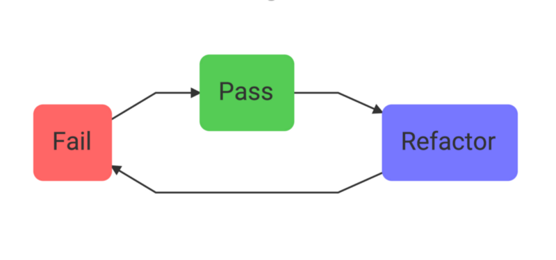
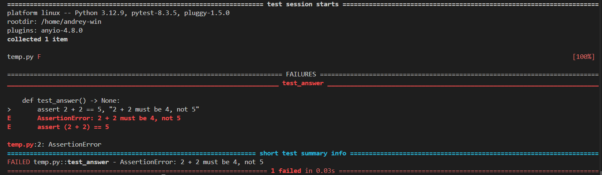

# Лабораторная работа 2. Тестирование кода на Python

## Содержание

## Тестирование и TDD

По мере разработки ПО и приложений рано или поздно возникает потребность в оценке поведения программы или какой-то её части, т.е. возникает потребность в **тестировании**. Это происходит по тому, что по мере роста кода отлавливать баги и ошибки (обнаруженные и/или потенциальные) становится задачей проблематичной, а в некоторых ситуациях (например, проект с легаси-кодом) - невозможной.

**Тестирование** - проверка соответствия реальных и ожидаемых результатов поведения программы, проводимая на конечном наборе тестов. Цель тестирования - проверка соответствия ПО предъявляемым требованиям, поиск очевидных ошибок в программном обеспечении, которые должны быть выявлены до того, как их обнаружат пользователи программы.

С началом 2000-х в среде программистов получила распространение концепция **разработки через тестирование (Test-Driven Development, TDD)**, введенная в оборот [Кентом Беком](https://habr.com/ru/companies/jugru/articles/580976/). Процесс разработки в данной методологии заключается в следующем:

1. Написать падающий тест, который покажет, какую функциональность необходимо добавить и как поведением она должна обладать;
2. Написать код, минимально достаточным для того, чтобы тест проходил. На этой стадии код не обязан быть элегантным или чистым;
3. Провести рефакторинг кода. Тесты позволяют безопасно "чистить" код, сделать его более читаемым и поддерживаемым



На практике программист **никогда не пишет сразу правильный код**: при разработке неизбежно возникают ошибки/баги, на отладку требуется затратить порой не меньшее время, чем было потрачено на само написание кода. Более того, не всегда очевидно **где возникает ошибка и из-за чего**, что также ведет к увеличению времени.

На первый взгляд кажется, что использование TDD приводит к написанию большего кода (иногда соотношение между тестами и самим кодом в промышленных проектах составляет 1:2 или 1:3), а следовательно, и увеличению времени выполнения проекта; если говорится о программисте, который не работает по TDD, то это скорее верно. Однако, при активном использовании методологии скорость разработки будет быстрее.

Благодаря тестированию можно **изолировать** ошибки, которые возникают в ходе выполнения программы, тем самым позволяя идентифицировать функциональность, которая является некорректной и должна быть исправлена. Также тесты могут выступать в виде своеобразной **спецификации**, т.е. как документация и пример, доказывающий работоспособность кода.

Таким образом, TDD позволяет:

1. Уменьшать время отладки;
2. Рефакторить код с гарантией работоспособности;
3. Получать данные о состоянии системы на основе тестов.

## Виды тестов и их основные характеристики

Всего существует несколько типов тестов, в частности:

1. Юнит-тест;
2. Интеграционный тест;
3. Сквозной тест.

### Юнит-тест

Существует множество определений юнит-тестов, однако все они сводятся к трем атрибутам.

**Юнит-тест** - автоматизированный тест, который:

1. Проверяет правильность работы некоторого фрагмента кода, называемого **юнитом**;
2. Делает это быстро;
3. Поддерживает изоляцию от другого кода.

Если с первыми двумя пунктами все более-менее понятно, то насчет третьего пункта имеют место разногласия, поскольку вопрос изоляции важен в контексте юнит-тестов. Вопрос изоляции - ключевое разногласие между двумя школами юнит-тестирования: **классической** и **лондонской** (или **мокистской**, от слова mock).

Лондонская школа описывает **изоляцию тестироваемого кода от его зависимостей**. То есть, если тестируемая функция или класс имеет в качестве зависимостей другие классы, то зависимости должны быть заменены на **тестовые заглушки** - легковесную версию класса-зависимости, удобной для тестов - или **моки** - подкласс тестовых заглушек, которые позволяют проанализировать взаимодействие между классами.

Преимущества подхода:

1. В случае падения точно известно место возникновения ошибки;
2. Возможность разбить граф объектов (классов, решающих одну задачу);
3. Простое правило тестирования: проверять один класс за раз (юнит не может быть больше 1 класса).

Классическая школа полагает изоляцию как **изоляцию тестов друг от друга** таким образом, что тесты могут быть выполнены параллельно и независимо. Классический подход не запрещает тестировать несколько классов за раз, если они не используют **совместные зависимости** - зависимости, к которым имеет доступ более одного теста - через которые тесты могут влиять на результат выполнения. Типичные примеры совместных состояний - внепроцессные зависимости - базы данных, файловая система, и т.п.

Такой подход к изоляции уменьшает объем моков и тестовых заглушек, причем если тест получает свою версию совместной зависимости (свою БД через контейнер Docker, класс-одиночка, для которого тесты не применяют паттерн Singleton, и т.п.), то такая зависимость становится приватной и может быть использоваться в юнит-тестах.

### Интеграционный тест и сквозной тест

**Интеграционный тест** - тест, который не удовлетворяет хотя бы одному критерию юнит-теста. На практике они всегда проверяют как система работает в интеграции с внепроцессными зависимостями. Если юнит-тесты проверяют доменную область, в котором работает приложение, то интеграционные тесты проверяют код, связывающий доменную область с внепроцессными зависимостями.

**Сквозной тест** - тест, который проверяет систему вместе с ее подсистемами, внепроцессными зависимостями и т.д. т начала и до конца для верификации выполнения полного производственного сценария.

Достаточно любопытно, что лондонская школа юнит-тестирования, исходя из описанных соображений по изоляции, полагает, что тест, который использует любой реальный объект-коллаборатор, является интеграционным из-за третьего критерия, в то время как классическая школа будет воспринимать такой тест как юнит-тест.

В интеграционных тестах важно понимать как внепроцессных зависимостей должны проверяться. Все внепроцессные зависимости делятся на два типа: **управляемые** (под полным контролем разработчика, например, БД) и **неуправляемые** (не под полным контролем, например почтовый сервер SMTP, результат взаимодействия виден другим). В случае управляемых зависимостей чаще всего взаимодействие является скрытым и не видны внешнему миру, т.е. взаимодействие является **деталью имплементации**, а такую зависимость можно использовать как реальную, не заменяя ее; в случае неуправляемых зависимостей взаимодействие является частью **наблюдаемого поведения (контракта)**, что ведет к необходимости их замены на моки.

## Тестирование в Python: pytest и unittest

Для языка программирования Python существуют множество инструментов тестирования, которые достаточно легко позволяют создавать и запускать тесты, проверять производительность, и много чего еще.

Обычно тесты в Python реализуются через модули **[pytest](https://docs.pytest.org/en/stable/)**, **[unittest](https://docs.python.org/3/library/unittest.html)** и **[doctest](https://docs.python.org/3/library/doctest.html)**, которые предоставляют широкий функционал для написания юнит-тестов.

### Pytest

Рассмотрим тривиальный тест:

```python
def test_answer() -> None:
    assert 2 + 2 == 5, "2 + 2 must be 4, not 5"
```

Простейший тест реализовывается следующим образом: в Python есть оператор `assert`, который позволяет проверять булевские условия; если условие assert-a не выполняется, то генерируется `AssertionError`, и если присутствует описание, то оно тоже выводится.

Такой тест можно выполнить через утилиту **pytest**, введя ``pytest <filename>`` (или ``pytest .``) в терминал. В результате будет что-то похожее на это:



Важно: по умолчанию pytest ищет файлы (и методы внутри него), содержащие в названии `test` в начале или конце (только для файлов), т.е. в формате `test_*.py` или `*_test.py` для файлов и `test*` для функций.

Рассмотрим теперь более похожий на реальный тест и его структуру:

```python
def factorial(n: int) -> int:
    """Calculates factorial of n"""
    if n in [0, 1]:
        return 1
    return n * factorial(n - 1)


def test_factorial() -> None:
    # arrange
    input = 5
    expected = 120
    
    # act
    got = factorial(input)
    
    # assert
    assert expected == got, f"Expected {expected}, got {got}"
```

В данном тесте присутствует паттерн **Arrange/Act/Assert(AAA)**, который рекомендуется применять при написании тестов:

1. **Arrange** - входные данные, которые принимает функция для работы (соединения с БД, параметры методов, и т.п.) и целевые данные, которые должны быть в результате выполнения функции;
2. **Act** - желаемое поведение: это может быть вызов функции, HTTP запрос по REST API, взаимодействие с веб-страницей.
3. **Assert** - проверка ожидаемого результата; иногда требуется один assert для проверки чисел или строк, иногда - комплексная верификация множества аспектов системы.

Тесты можно параметризовать для группировки схожих тестов:

```python
@pytest.mark.parametrize(
    ("number", "expected"),
    [
        (0, 1),
        (1, 1),
        (5, 120),
    ],
)
def test_factorial(number: int, expected: int) -> None:
    got = factorial(number)
    
    assert expected == got
```

Некоторые тесты можно пропускать во время выполнения тестирования, если выполняется условие, или вовсе выключать тест, который не является в данный момент нужным, но в будущем может использовать в случае изменения кода:

```python
@pytest.mark.skip(
  reason = "Известная ошибка в версии библиотеки 1.2.3, исправление ожидается в следующем релизе",
)
def test_some_function() -> None:
    assert some_function() == expected_result

@pytest.mark.skipif(
    sys.platform == "win32", 
    reason = "Тест не поддерживается на Windows",
)
def test_unix_specific_function() -> None:
    assert unix_specific_function() == expected_result
```

Для создания тестовых заглушек можно воспользоваться специальными функциями, называемыми **фикстурами**, которые будут внедрены автоматически как требуемые зависимости:

```python
@pytest.fixture()
def price_manager() -> PriceManager:
    return PriceManager(
        x_price_source = StubXPriceSource(return_result = Decimal("150.00")),
        y_price_source = StubYPriceSource(return_result = Decimal("220.00")),
    )

    
class TestPriceManager: 
    def test_get_price_if_product_type_eq_x(self, price_manager: PriceManager) -> None:
        product = Product(type = "x")
        
        got = price_manager.get_price(product)
        
        assert got == Decimal("150.00")
    ...
```

Преимущество фикстур заключается в том, что они являются достаточно гибкими, они могут:

1. Они могут использоваться без необходимости импортирования (если фикстура в другом файле определена);
2. Фикстура может вызываться по требованию (раз в сессию тестирования, каждый раз при вызове тестовой функции, и т.п);
3. Фикстуры можно использоваться внутри других фикстур;
4. Фикстура параметризуема (можно передавать аргументы в нее).

### Unittest

**Unittest** является фреймворком для юнит-тестирования, который похож на фреймворк JUnit под Java и имеет схожую логику работы. Он поддерживает автоматизированные тесты, агрегацию тестов, гибкую конфигурацию и т.д.

В рамках фреймворка группа тестов называется **тестовыми кейсами (test case)**, который может быть **позитивными** (проверка кода при нормальных условиях) и  **негативными** (код проверяется на ситуациях некорректного/неожиданного ввода или пограничных ситуаций). В коде test cases реализуется в виде класса, который наследуется от класса `TestCase`.

Пусть есть некоторая функция, которая будет протестирована:

```python
def my_sum(arg):
    total = 0
    for val in arg:
        total += val
    return total
```

Тест для такой функции через unittest будет выглядеть следующим образом:

```python

import unittest

def my_sum(arg):
    total = 0
    for val in arg:
        total += val
    return total

class TestSum(unittest.TestCase):
    def test_list_int(self):
        """
        Test that it can sum a list of integers
        """
        data = [1, 2, 3]
        expected = 6

        result = my_sum(data)

        self.assertEqual(result, expected)

if __name__ == '__main__':
    unittest.main()

```

В отличие от pytest здесь используется assert-методы базового класса при проверке. TestCase обладает широким спектром assert-методов, которые помогают разбирать разные аспекты поведения проверяемого кода. Пусть есть класс-калькулятор, который отрабатывает пограничные ситуации наподобия деления на ноль, или передачу некорректного параметра:

```python
class Operation:

    def __init__(self):
       pass

    def add(self,a,b):
      if not isinstance(a, (int, float)):
         raise ValueError("Value must be either an integer or a float.")
      
      if not isinstance(b, (int, float)):
         raise ValueError("Value must be either an integer or a float.")
      return a+b
    
    def minus(self,a,b):
      if not isinstance(a, (int, float)):
         raise ValueError("Value must be either an integer or a float.")
      
      if not isinstance(b, (int, float)):
         raise ValueError("Value must be either an integer or a float.")
      return a-b
    
    def mul(self,a,b):
      if not isinstance(a, (int, float)):
         raise ValueError("Value must be either an integer or a float.")
      
      if not isinstance(b, (int, float)):
         raise ValueError("Value must be either an integer or a float.")
      return a*b
    
    def div(self,a,b):
      if not isinstance(a, (int, float)):
         raise ValueError("Value must be either an integer or a float.")
      if not isinstance(b, (int, float)):
         raise ValueError("Value must be either an integer or a float.")
    
      if b==0:
         raise ValueError("Zero division error")
      return a/b
```

Тогда можно написать целое множество тестов, которое покрывает код:

```python
import unittest
import sample

class TestSample(unittest.TestCase):  

    def __init__(self, methodName='runTest'):  
        super().__init__(methodName)  

        # Test data 
        self.a1 = 20
        self.a2 = 'Ram'
        self.b1 = 10
        self.b2 = 0
        self.checker = sample.Operation()  # Creating the object

    def test_add(self):
        # Positive test case
        result = self.checker.add(self.a1, self.b1)
        self.assertEqual(result, 30)

        # Negative test case for data type
        with self.assertRaises(ValueError) as context:
            self.checker.add(self.a2, self.b1)
        self.assertEqual(str(context.exception), "Value must be either an integer or a float.")

    def test_minus(self):
        # Positive test case
        result = self.checker.minus(self.a1, self.b1)
        self.assertEqual(result, 10)

        # Negative test case for data type
        with self.assertRaises(ValueError) as context:
            self.checker.minus(self.a2, self.b1)
        self.assertEqual(str(context.exception), "Value must be either an integer or a float.")

    def test_mul(self):
        # Positive test case
        result = self.checker.mul(self.a1, self.b1)
        self.assertEqual(result, 200)

        # Negative test case for data type
        with self.assertRaises(ValueError) as context:
            self.checker.mul(self.a2, self.b1)
        self.assertEqual(str(context.exception), "Value must be either an integer or a float.")

    def test_div(self):
        # Positive test case
        result = self.checker.div(self.a1, self.b1)
        self.assertEqual(result, 2)

        # Negative test case for data type
        with self.assertRaises(ValueError) as context:
            self.checker.div(self.a2, self.b1)
        self.assertEqual(str(context.exception), "Value must be either an integer or a float.")

        # Negative test case for zero division
        with self.assertRaises(ValueError):
            self.checker.div(self.a1, self.b2)

if __name__ == "__main__":
    unittest.main()    
```

Запускаются тесты следующей командой:

```bash
python -m unittest <filemame>
```

Если требуется запускать конкретные тесты или классы, то можно выполнить это следующим образом:

```bash
# тестируется два модуля
python -m unittest test_module1 test_module2
# тестируются все тесты данного класса
python -m unittest test_module.TestCase
# тестируется только один тест
python -m unittest test_module.TestCase.test_method
```

Для мокирования и создания тестовых заглушек можно воспользоваться подмодулем [unittest.mock](https://docs.python.org/3/library/unittest.mock.html), который реализует данную функциональность через классы **Mock** и **MagicMock** и декоратор `@patch`.

Пусть есть функция, которая проверяет является ли дата рабочим днем (в простой ситуации, без учета праздников или других особенностей):

```python
import datetime

def is_weekday():
    today = datetime.date.today()
    return 0 <= today.weekday() < 5

```

Напишем простые тесты для проверки кода:

```python
import datetime
import unittest
from unittest.mock import patch

import weekday

class TestWeekday(unittest.TestCase):
    @patch("weekday.datetime")
    def test_is_weekday(self, mock_datetime):
        mock_datetime.date.today.return_value = datetime.date(2024, 4, 4)
        self.assertTrue(weekday.is_weekday())

    @patch("weekday.datetime")
    def test_is_weekend(self, mock_datetime):
        mock_datetime.date.today.return_value = datetime.date(2024, 4, 6)
        self.assertFalse(weekday.is_weekday())

if __name__ == "__main__":
    unittest.main()
```

При помощи декоратора `@patch` можно создавать моки для каждой функции, оборачивая модуль datetime, который вызывается в модуле weekday (таким нехитрым образом можно заменять зависимости в виде модулей и тестировать целевой код). Созданный мок принимается тестовыми методами как параметр `mock_datetime`, при этом параметр будет вести себя как модуль для тестируемого модуля. Указывая нужные данные в качестве тех, которые должны быть возвращены моком, можно выполнять тесты.

Примечательно, что pytest умеет выполнять тесты, реализованные через модуль unittest, а в свою очередь тесты на unittest поддерживают применение фичей из pytest, например, фикстуры.

### Doctest

**Doctest** - инструмент тестирования, который выполняет тесты, исходя из **docstrings, написанных в определенных форматах**.

Как это делается: пусть реализуется факториал. Тогда для того, чтобы тестирование через doctest сработало, нужно отформатировать соответствующий docstring следующим образом:

```python
"""
This is the "example" module.

The example module supplies one function, factorial().  For example,

>>> factorial(5)
120
"""

def factorial(n):
    """Return the factorial of n, an exact integer >= 0.

    >>> [factorial(n) for n in range(6)]
    [1, 1, 2, 6, 24, 120]
    >>> factorial(30)
    265252859812191058636308480000000
    >>> factorial(-1)
    Traceback (most recent call last):
        ...
    ValueError: n must be >= 0

    Factorials of floats are OK, but the float must be an exact integer:
    >>> factorial(30.1)
    Traceback (most recent call last):
        ...
    ValueError: n must be exact integer
    >>> factorial(30.0)
    265252859812191058636308480000000

    It must also not be ridiculously large:
    >>> factorial(1e100)
    Traceback (most recent call last):
        ...
    OverflowError: n too large
    """

    import math
    if not n >= 0:
        raise ValueError("n must be >= 0")
    if math.floor(n) != n:
        raise ValueError("n must be exact integer")
    if n+1 == n:  # catch a value like 1e300
        raise OverflowError("n too large")
    result = 1
    factor = 2
    while factor <= n:
        result *= factor
        factor += 1
    return result


if __name__ == "__main__":
    import doctest
    doctest.testmod()
```

Если вы запустите скрипт через командную строку, то вы ничего не заметите (если нет ошибок в docstring):

```bash
$ python example.py
$
```

Если передать параметр `-v`, то тогда можно увидеть детальный лог с результатами тестов:

```bash
$ python example.py -v
Trying:
    factorial(5)
Expecting:
    120
ok
Trying:
    [factorial(n) for n in range(6)]
Expecting:
    [1, 1, 2, 6, 24, 120]
ok
...
```

Подход с инкапсуляцией тестового кода внутри docstring может принести дополнительную пользу, если проект использует **автоматизированные генераторы документации** такие, как **MkDocs** или **Sphinx**, которые очень популярны для создания веб-страниц с подробным описанием проекта, предоставления документации и примеров использования.

## Метрики тестирования: code coverage и branch coverage

Для оценки качества тестов очень часто используют специальные метрики, которые служат некоторым индикатором тестового покрытия системы. Наиболее популярными метриками являются **code covarege (test coverage)** и **branch coverage**. Выглядят они следующим образом:

$$ \text{Code coverage} = \frac{\text{Количество выполненных тестов}}{\text{Общее количество строк кода}} $$

$$ \text{Branch coverage} = \frac{\text{Количество покрытых ветвей}}{\text{Общее количество ветвей}} $$

Значит ли, что при написании тестов метрика 100% - это хорошо, а 0% - это плохо? Не совсем, слишком маленькое значение покрытия (например, 10%) - хороший признак того, что тестов слишком мало. Однако, обратное неверно: даже 100%-ное покрытие не гарантирует хорошего качества кода. поскольку сами тесты могут быть плохого качества. Добавление случайных тестов, которые повышают процент покрытия, не дает уверенности в качестве кода. **Процент покрытия - это хороший негативный индикатор, но не гарантия хорошего теста.**

Рассмотрим простую функцию:

```python
def is_even(number):
    if number % 2 == 0:
        return True
    else:
        return False
```

И пусть есть следующие тесты:

```python
import pytest
from my_module import is_even

def test_is_even()
    assert is_even(2) == True
```

В данном примере можно понять, что тест покрывает 2 строки кода (если бы был язык, где блоки отделялись фигурными скобками, то их тоже бы считали), а также 1 ветку:

$$ \text{Code coverage} = \frac{2}{4} = 50 \% $$
$$ \text{Branch coverage} = \frac{1}{2} = 50 \% $$

Перепишем исходную функцию следующимо образом:

```python
def is_even(number):
    return number % 2 == 0
```

Теперь тот же тест выдаст следующие значения метрик:

$$ \text{Code coverage} = \frac{1}{1} = 100 \% $$
$$ \text{Branch coverage} = \frac{1}{2} = 50 \% $$

Как видно, code coverage стало 100%-ным, в то время как branch coverage осталось тем же. При увеличении процента покрытия качество кода не изменилось, таким образом, первой метрикой очень легко манипулировать.

Иное дело с метрикой branch coverage, ибо она смотрит только на наличие условных операторов (в Python это *if* и *match-case*), причем неважно в какой форме - в виде непосредственно операторов или в более короткой записи, как показано в примере. Но и у этой метрики есть свои проблемы:

+ Невозможно гарантировать, что тест проверяет все компоненты результата работы тестируемой системы;
+ Ни одна метрика покрытия не может учитывать ветвления кода во внешних библиотеках.

В Python с метриками покрытия можно работать двумя путями:

1. **[pytest-cov](https://pytest-cov.readthedocs.io/en/latest/index.html)** - плагин, расширяющий функционал pytest; фичи пакета активируются как параметры команды `pytest`, например:

    ```bash
    pytest --cov=sample --cov-report=term-missing --cov-branch test.py
    ```

    где *sample* - тестируемый модуль (или пакет), --cov-branch - включение метрики branch coverage, --cov-report=term-missing отслеживает выключенные тесты, и т.д.

2. **[coverage](https://coverage.readthedocs.io/en/7.6.12/)** - инструмент для измерения покрытия, который позволяет работать как с unittest\pytest, так и с более экзотическими фреймворками. Запускается coverage следующим образом:

    ```bash
    coverage run -m unittest ...
    ```

    После запуска утилиты будет сгенерирован файл с результатами выполнения, доступ к которым можно получить в разных форматах следующими командами:

    ```bash
    coverage report
    coverage html
    coverage json
    coverage xml
    ...
    ```

## Линтеры: Pylint, mypy, bandit

**Линтеры** - специальные утилиты, которые сканируют код и анализируют на предмет какого-либо аспекта, например, следование PEP 8 (**[Pylint](https://pylint.readthedocs.io/en/stable/index.html)**), проверка типов на основе аннотаций (**[mypy](https://mypy.readthedocs.io/en/stable/)**), проверка на уязвимости в области безопасности (**[bandit](https://bandit.readthedocs.io/en/latest/)**), т.п.

Линтеры очень удобны при автоматизации проверки качества кода при собственно разработке и тестировании. Также их можно интегрировать с инструментами автоматизации, например, **tox**.

### Pylint

**Pylint** является статическим анализатором кода, который проверяет качество кода по многим критериям (следование PEP 8, стандарты написания кода, как общие для сообщества Python, так и для конкретных команд), предлагает стилистические или логические улучшения, а также генерирует предупреждения такие, как неиспользуемые переменные, импорты, и т.п. Cписок возможных сообщений с некоторым описанием можно посмотреть [здесь](https://pylint.readthedocs.io/en/stable/user_guide/messages/messages_overview.html) или [здесь](https://habr.com/ru/companies/leader-id/articles/499870/).

Как правило, pylint или линтеры, на него похожие (flake8, к примеру), интегрируются или уже интегрированы в большинство современных IDE (PyCharm, VS Code, и т.д.).

### Bandit

**Bandit** - инструмент с открытым исходным кодом для поиска наиболее популярных уязвимостей в сфере безопасности, распространенные в Python. Bandit анализирует код, пытаясь обнаружить места, которые могут использовать хакеры или иные недоброжелатели для проведения атак на систему.

Наиболее популярными уязвимостями, которые пытается обнаружить bandit, являются **SQL-иньекции** и **Командные иньекции**.

**SQL-иньекции** - атака, целью которой является получить несанкционированный доступ к базе данных и получить доступ к данным или их уничтожить. Например, пусть есть простой код на Django, выполняющий запрос к БД:

```python
from django.db import connection

def find_user(username):
    with connection.cursor() as cur:
        cur.execute(f"""select username from USERS where name = '%s'""" % username)
        output = cur.fetchone()
    return output
```

Обычно такой SQL-запрос будет выглядеть следующим образом:

```sql
select username from USERS where name = 'Foobar'
```

Однако, злоумышленник может сделать запрос вида:

```sql
select username from USERS where name = ''; DROP TABLE USERS; --'
```

где ``--'`` является экранированием одинарной кавычки, делая предыдущие символы доступными для выполнения как запросы.

Проблема в данном случае заключается в отсутствии валидации параметров функции, из-за чего в качестве username можно отправить `'; DROP TABLE USERS; --`, что удалит базу данных.

**Командная иньекция** - атака, целью которой является выполнение произвольных команд в ОС сервера. Атака срабатывает, например, при запуске процесса с помощью функций модуля *subprocess*, когда в качестве аргументов используются значения, хранящиеся в переменных программы.

Например, рассмотрим следующий код, который выводит результат команды nslookup (информацию о домене):

```python
# nslookup.py

import subprocess
domain = input("Enter the Domain: ")
output = subprocess.check_output(f"nslookup {domain}", shell=True, encoding='UTF-8')
print(output)
```

Что тут может пойти не так? Если пользователь введет, например, ``www.ya.ru; ls``, то результатом скрипта станет не только информация о домене, но и содержимое рабочего каталога, где запускается подпроцесс. Если в случае команды ls это не так страшно (хотя и такое может нести вред), при команде `cat /etc/passwd` будут выведены **все пароли**, которые зарегистрированы для системы.

Утилита bandit позволяет находить такие уязвимости (как и многие другие, например, отключение assert-ов), чтобы разработчик мог устранить обнаруженную уязвимость.

### mypy

**mypy** - статический анализатор типа, который проверяет код по оставленным в нем аннотациям (и аннотациям сторонних библиотек). Такой подход позволяет находить баги и ошибки, связанные с неправильными типами, импортами, и т.п., и устранять их до запуска программы.

К примеру, для следующего кода mypy выведет ошибку (хотя при этом **реальной ошибки может и не быть**):

```python
number = input("What is your favourite number?")
print("It is", number + 1)  # error: Unsupported operand types for + ("str" and "int")
```

Mypy позволяет через аннотации совершенствовать код, устраняя ситуации, которые могут потенциально привести к ошибкам по типам, а также улучшая поддерживаемость кода, чтобы другие разработчики при использовании вашего кода могли понимать что подразумевается в том или ином случае.

## Автоматизация тестирования: tox

Тестирование позволяет проверять ошибки, а также контролировать качество кода, но вот вопрос: **будет ли работать тестируемый код во всех средах Python и со всеми версиями зависимостей/библиотек?**.

В общем случае, ответ - нет, поскольку у Python нет полноценной и нормально работающей обратной совместимости, из-за чего возникает множество проблем при обновлении программных сред, версий библиотек и т.д.

Для устранения проблем с программным окружением, а также автоматизации тестирования в разных средах, был разработан инструмент **[Tox](https://tox.wiki/en/4.24.2/)**. Основной целью этой утилиты является общее управление виртуальными средами при тестировании, чтобы проекты собирались и развертывались корректно в разных виртуальных средах (не только в плане версий библиотек или языка, но и имплементаций самого Python), автоматизация тестов, а также интеграция с CI (Continuous Integration - CI) сервисами.

Чтобы запустить tox для проекта, нужно определить **конфигурационный файл** с информацией об инструментах, которые должны быть использованы и как подготовить под них тестовую среду. Обычно такой файл называется **tox.ini** или **tox.toml**. В случае toml-файла это выглядит следующим образом:

```toml
requires = ["tox>=4"]
env_list = ["lint", "type", "3.13", "3.12", "3.11"]

[env_run_base]
description = "run unit tests"
deps = [
    "pytest>=8",
    "pytest-sugar"
]
commands = [["pytest", { replace = "posargs", default = ["tests"], extend = true }]]

[env.lint]
description = "run linters"
skip_install = true
deps = ["black"]
commands = [["black", { replace = "posargs", default = ["."], extend = true} ]]

[env.type]
description = "run type checks"
deps = ["mypy"]
commands = [["mypy", { replace = "posargs", default = ["src", "tests"], extend = true} ]]
```

Первые две строки выполняются для всех сред и определяет как tox выполняется. Здесь обычно указывается информация о версии tox или файловый путь до проекта.

``[env_run_base]`` таблица и ее настройки **автоматически наследуются** всеми средами, кроме ситуаций переопределения конкретных настроек. Названия тестовых сред должны содержать цифры, буквы на английском языке или тире. Если в названии присутствует `pyNM`, то полагается, что среда должна быть запущена на стандартной имплементации Python с версией *N.M* (например, 3.11); данное правило аналогично работает и для других имплементаций Python (СPython, Jython, и т.д.).

Далее идет описание уже самой тестовой среды, а также команды, которые будут выполняться (в частности, параметры инструментов тестирования).

## Задание

1. Реализуйте модуль (отдельный файл с расширением .py) с некоторой функциональностью (по вариантам), учитывая пограничные ситуации, которые могут возникнуть при работе с вашим кодом. Код должен быть оформлен по правилам PEP 8 и PEP 256.
2. Напишите набор тестов с применением pytest\unittest\doctest, который будет проверять различные варианты применения вашего кода. Протестируйте его с применением метрик покрытия. Если код имеет зависимости, то замените их моками или тестовыми заглушками (библиотеки можно заменять по желанию, хотя приветствуется и их замена). По возможности, автоматизируйте с помощью tox выполнение тестов.
3. Представьте результаты тестов в виде файла output.txt (если запускать tox в терминале, то к командам запуска можно добавить в конец `>> output.txt`, который перенаправляет вывод из консоли в файл).

Варианты:

1. **Валидация пароля**. Напишите код, который проверяет, удовлетворяет ли пароль заданным требованиям (длина, наличие спец. символов и цифр).
2. **Поиск палиндромных подстрок**. Напишите код, который проверяет наличие палиндромных подстрок в некоторой строке и выводит их количество вместе с самими подстроками.
3. **Конвертер целых чисел в римские**. Напишите код, который переводит целые числа в римские и обратно. Учтите возможный диапазон чисел, который может быть обработан.
4. **Возведение числа с плавающей точкой в степень**. Напишите код, которая возводит число с плавающей точкой в некоторую целочисленную степень. Учтите вопрос переполнения числа.
5. **Медиана двух сортированных массивов**. Напишите код нахождения медианы двух сортированных массивов. Учтите, что массивы могут быть пустыми.
6. **Проверка двух строк на анаграмму**. Напишите код проверки двух строк на анаграмму.
7. **Калькулятор**. Напишите код, который получает на входе строку, представляющую собой некоторое математическое выражение (только '+', '-', '*', '/') с целыми числами в качестве операндов (например, "3+3\*3/3"). Использовать функцию eval() не допускаются.
8. **Инвертирование подстрок между каждой парой скобок**. Пусть есть некоторая строка, состоящая из английских букв в нижнем регистре и скобок (например, "(u(love)i)"). Напишите код, который инвертирует каждую подстроку внутри каждой пары скобок, начиная со внутренних. Результат не должен содержать скобки.
9. **Нахождение НОД**: Напишите функцию для нахождения наибольшего общего делителя двух чисел. Учтите случаи с отрицательными числами.
10. **Проверка симметрии матрицы**: Напишите функцию, которая проверяет, является ли матрица симметричной. Учтите пустые матрицы и несимметричные размеры.
