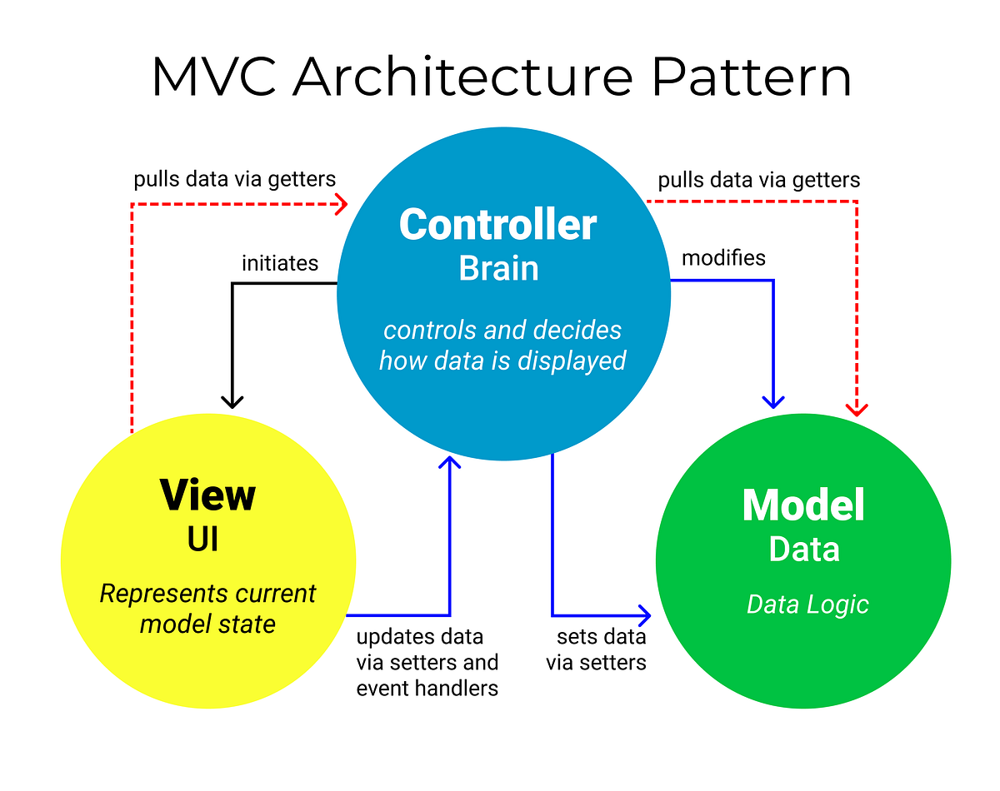

# Лабораторная работа 5. Веб-программирование и работа в сети

## Содержание

- [Лабораторная работа 5. Веб-программирование и работа в сети](#лабораторная-работа-5-веб-программирование-и-работа-в-сети)
  - [Содержание](#содержание)
  - [Устройство Интернета: IP-адреса, домены](#устройство-интернета-ip-адреса-домены)
  - [HTTP](#http)
  - [Сокеты](#сокеты)
  - [API и API-интерфейсы, RESTful API](#api-и-api-интерфейсы-restful-api)
  - [MVC: модель, представление, контроллер](#mvc-модель-представление-контроллер)
  - [Задания](#задания)
    - [Требования](#требования)
    - [Варианты](#варианты)

## Устройство Интернета: IP-адреса, домены

**Интернет** - это глобальная сеть, которая соединяет миллионы частных, государственных, учебных и бизнес-компьютеров по всему миру. Он состоит из множества сетей, которые используют стандартные протоколы для связи друг с другом. Из-за своей глобальной природы Интернет не имеет единой точки управления, и его структура децентрализована, что требует наличия стандартов и протоколов для обеспечения совместимости между различными системами.

На наиболее базовом уровне Интернет состоит из физических соединений между компьютерами, которые могут быть реализованы с помощью различных технологий, таких как оптоволокно, медные кабели и беспроводные сети. Эти соединения образуют **локальные сети** (Local Address Network - LAN), которые затем соединяются друг с другом через специальные устройства маршрутизаторы и коммутаторы, образуя более крупные сети.


Чтобы компьютеры могли находить друг друга в этой сложной сети, каждому устройству в Интернете присваивается уникальный **IP-адрес** (Internet Protocol Address) - числовой идентификатор, который позволяет устройствам обмениваться данными друг с другом. Существует два класса IP-адресов: IPv4 и IPv6. IPv4 - это 32-битный адрес формата xxx.xxx.xxx.xxx, где xxx - число от 0 до 255, который может представлять около 4 миллиардов уникальных адресов, тогда как IPv6 - это 128-битный адрес в шестнадцатеричном формате (к примеру, *2001:0db8:11a3:09d7:1f34:8a2e:07a0:765d*), который может представлять гораздо большее количество уникальных адресов. Примеры IP-адресов:

- *127.0.0.1* - это адрес локального хоста (**localhost**), который используется для обращения к самому себе. Он часто используется для тестирования и отладки приложений.
- *8.8.8.8* - это адрес публичного DNS-сервера Google, который можно использовать для разрешения доменных имен в IP-адреса.

Также сети разделяются на **подсети** (subnet), которые представляют собой логические группы устройств внутри сети. Подсети позволяют организовать и управлять сетевыми ресурсами более эффективно, а также обеспечивают безопасность и изоляцию между различными группами устройств. Адрес подсетей и их размер определяется **маской подсети**:

- *192.168.0.0/24* означает, что подсеть содержит 256 адресов, включая адрес сети (*192.168.0.0*) и широковещательный адрес (*192.168.0.255*), а также маска сетевого префикса /24 указывает на то, что первые 24 бита адреса используются для идентификации сети, а оставшиеся 8 бит - для идентификации устройств в этой сети, т.е. маска сети - *255.255.255.0*.

Одной из проблем, связанных с использованием IP-адресов, является то, что они трудны для запоминания людьми. Для упрощения доступа к веб-сайтам и другим ресурсам в Интернете, была разработана **система доменных имен** (Domain Name System - DNS), которая позволяет использовать более удобные для восприятия имена вместо числовых адресов.

Например, вместо того чтобы запоминать IP-адрес веб-сайта, вы можете просто ввести его доменное имя, такое как *<www.google.com>* или *<www.yandex.ru>*. DNS работает как телефонная книга для Интернета, сопоставляя доменные имена с соответствующими IP-адресами. Когда вы вводите доменное имя в адресной строке браузера, ваш компьютер отправляет запрос на сервер DNS, который возвращает соответствующий IP-адрес, позволяя вашему компьютеру подключиться к нужному ресурсу. При расшифровке доменных имен в IP-адреса имена читаются справа налево, начиная с самого последнего уровня. Например, в доменном имени *<www.yandex.ru>*:

- **ru** - это домен верхнего уровня (TLD), который указывает на страну или организацию, к которой принадлежит сайт.
- **yandex** - это второй уровень домена, который указывает на конкретный сайт или организацию.
- **www** - это поддомен, который указывает на конкретный сервер или службу внутри домена.


Таким образом, полное доменное имя *<www.yandex.ru>* указывает на веб-сервер Yandex в России. Система доменных имен позволяет легко находить и идентифицировать ресурсы в Интернете, делая его более доступным для пользователей.

## HTTP

**HTTP (Hyper-Text Transfer Protocol)** - это протокол передачи данных, который используется для обмена информацией между клиентом и сервером в Интернете. Он определяет правила и форматы, которые должны соблюдаться при передаче данных, чтобы обеспечить корректное взаимодействие между различными системами.

HTTP работает по принципу клиент-серверной архитектуры, где клиент (обычно веб-браузер) отправляет запросы на сервер, который обрабатывает эти запросы и возвращает ответы. Запросы и ответы передаются в виде текстовых сообщений, которые содержат **заголовки** и **тело сообщения**. Допустим, нужно отправить запрос на получение веб-страницы <www.google.com>. В этом случае клиент отправляет HTTP-запрос, который может выглядеть следующим образом:

```http
GET / HTTP/1.1
Host: www.google.com
```

В этом запросе:

- `GET` - это метод HTTP, который указывает на то, что клиент хочет получить ресурс (в данном случае веб-страницу).
- `/` - это путь к ресурсу на сервере (в данном случае корневая страница).
- `HTTP/1.1` - это версия протокола HTTP, которую использует клиент.
- `Host: www.google.com` - это заголовок, который указывает на доменное имя сервера, к которому клиент обращается.

Сервер обрабатывает этот запрос и отправляет ответ, который может выглядеть следующим образом:

```http
HTTP/1.1 200 OK
Content-Type: text/html; charset=UTF-8
<!DOCTYPE html>
...
<html>
<head>
    <title>Google</title>
</head>
<body>
    <h1>Welcome to Google!</h1>
    ...
</body>
</html>
```

В этом ответе:

- `HTTP/1.1 200 OK` - это статусный код, который указывает на то, что запрос был успешно обработан (код 200 означает "OK").
- `Content-Type: text/html; charset=UTF-8` - это заголовок, который указывает на тип содержимого, которое возвращает сервер (в данном случае HTML-страница с кодировкой UTF-8).
- Тело ответа содержит HTML-код веб-страницы, которую клиент запрашивал.

HTTP поддерживает различные методы, которые определяют тип операции, которую клиент хочет выполнить. Наиболее распространенные методы включают:

- `GET` - запрашивает ресурс с сервера.
- `POST` - отправляет данные на сервер для создания нового ресурса.
- `PUT` - обновляет существующий ресурс на сервере.
- `DELETE` - удаляет ресурс с сервера.

Полный список методов можно найти в [документации команды Mozilla](https://developer.mozilla.org/ru/docs/Web/HTTP/Methods).

HTTP также поддерживает различные статусные коды, которые указывают на результат обработки запроса. Некоторые из наиболее распространенных статусных кодов включают:

- `200 OK` - запрос успешно обработан.
- `201 Created` - ресурс успешно создан.
- `204 No Content` - запрос успешно обработан, но нет содержимого для возврата.
- `400 Bad Request` - запрос не может быть обработан из-за неверного синтаксиса.
- `401 Unauthorized` - запрос требует аутентификации.
- `403 Forbidden` - сервер отказывается выполнять запрос.
- `404 Not Found` - запрашиваемый ресурс не найден.
- `500 Internal Server Error` - ошибка на стороне сервера.
- `503 Service Unavailable` - сервер временно недоступен.
- `504 Gateway Timeout` - сервер не получил ответ от другого сервера.

Полный список кодов можно найти в [документации команды Mozilla](https://developer.mozilla.org/ru/docs/Web/HTTP/Status).

В Python HTTP-запросы можно отправлять с помощью библиотеки `requests`, которая предоставляет простой и удобный интерфейс для работы с HTTP. Например, чтобы отправить GET-запрос на получение веб-страницы, можно использовать следующий код:

```python
import requests

response = requests.get('https://www.google.com')

print(response.status_code, response.reason, end='\n\n')
print(response.headers, end='\n\n')
print(response.text)
```

Библиотека поддерживает все основные методы HTTP и позволяет легко отправлять запросы, обрабатывать ответы и работать с заголовками. Например, чтобы отправить POST-запрос с данными в формате JSON, можно использовать следующий код:

```python
import requests
import json
url = 'https://api.example.com/resource'
data = {'key': 'value'}
response = requests.post(url, json=data)
print(response.status_code, response.reason, end='\n\n')
print(response.headers, end='\n\n')
print(response.json())
```

## Сокеты

**Сокеты** - это программные интерфейсы, которые позволяют приложениям обмениваться данными по сети как внутри одного компьютера, так и в рамках Интернета. Они обеспечивают механизм для установления соединения между двумя компьютерами и передачи данных между ними. Сокеты могут использоваться для создания клиент-серверных приложений, где один компьютер (клиент) отправляет запросы на другой компьютер (сервер), который обрабатывает эти запросы и отправляет ответы обратно.

В Python сокеты реализованы в модуле `socket`, который предоставляет функции для создания, настройки и управления сокетами. Для создания простого клиент-серверной коммуникации с использованием сокетов, можно использовать следующий код:

```python
# server.py
import socket

host = "127.0.0.1"
port = 5001

server = socket.socket(socket.AF_INET)

server.bind((host, port))
server.listen()
print("Server started at: " + host + ":" + str(port))
print("Waiting for connection...")

conn, addr = server.accept()
print("Connection from: " + str(addr))

while True:
   data = conn.recv(1024).decode()
   if not data:
      break
   data = str(data).upper()
   print ("Message from client: " + str(data))
   data = input("Type message (or 'q' to quit): ")
   if data.lower() == 'q':
       break
   conn.send(data.encode())
conn.close()
```

```python
# client.py
import socket

host = '127.0.0.1'
port = 5001

obj = socket.socket(socket.AF_INET)
obj.connect((host, port))
print ("Connected to server at: " + host + ":" + str(port))

while (message := input("type message (or 'q' to quit): ")) != 'q':
    obj.send(message.encode())
    print ("Waiting for message from server...")

    data = obj.recv(1024).decode()
    if not data:
        break
    print('Received from server: ' + data)
obj.close()
```

Чтобы запустить сервер, выполните `python server.py`, а затем в другом терминале выполните `python client.py`. После этого вы сможете отправлять сообщения между клиентом и сервером.

Сокеты могут использовать различные **протоколы для передачи данных**, такие как **TCP (Transmission Control Protocol)** и **UDP (User Datagram Protocol)**. TCP - это надежный протокол, который обеспечивает гарантированную доставку данных и управление потоком, в то время как UDP - это менее надежный протокол, который не гарантирует доставку данных, но обеспечивает более быструю передачу:

```python
# TCP
import socket
s = socket.socket(socket.AF_INET, socket.SOCK_STREAM)

# UDP
s = socket.socket(socket.AF_INET, socket.SOCK_DGRAM)
s.bind(('localhost', 12345))
```

Параметр `socket.SOCK_STREAM` указывает на использование TCP, а `socket.SOCK_DGRAM` - на использование UDP.

## API и API-интерфейсы, RESTful API

**API (Application Programming Interface)** - это набор правил и протоколов, которые позволяют различным программным компонентам взаимодействовать друг с другом. API определяет, как различные части программного обеспечения могут обмениваться данными и вызывать функции друг друга.

API может быть реализован в различных формах, включая библиотеки, фреймворки и веб-сервисы. Именно через API разработчики могут интегрировать различные системы и использовать их функциональность в своих приложениях. Например, API может позволить вашему приложению взаимодействовать с базой данных, отправлять электронные письма или получать данные из внешнего веб-сервиса.

Как правило, API предоставляет набор функций и методов, которые можно вызывать из вашего кода. Эти функции могут принимать параметры и возвращать результаты, что позволяет разработчикам использовать API для выполнения различных задач. Функции API могут быть реализованы в виде библиотек, которые можно подключить к вашему проекту, или в виде веб-сервисов, которые можно вызывать через HTTP-запросы.

**REST (Representational State Transfer)**- это архитектурный стиль, который используется для создания веб-сервисов и веб-API. Он основан на принципах HTTP и использует стандартные методы HTTP (GET, POST, PUT, DELETE и т.д.) для выполнения операций над ресурсами.

Сервисы, которые соответствуют , называются **RESTful API**. RESTful API позволяет клиентам взаимодействовать с сервером через простые и понятные URL-адреса, что делает его удобным для использования в веб-приложениях.

RESTful API имеет важное характеристики, которые отличают его от других архитектурных стилей:

1. **Клиент-серверная архитектура**: RESTful API разделяет клиентскую и серверную части, что позволяет им развиваться независимо друг от друга. Клиент может быть любым устройством, которое может отправлять HTTP-запросы, а сервер - это приложение, которое обрабатывает эти запросы и возвращает ответы.
2. **Идентификация ресурсов**: Каждый *ресурс* (все, что требуется отобразить через запрос) в RESTful API имеет уникальный URL-адрес, который позволяет клиентам получать доступ к этому ресурсу. Например, URL-адрес *<https://api.example.com/users/123>* может представлять пользователя с идентификатором 123.
3. **Статусные коды**: RESTful API использует стандартные HTTP статусные коды для обозначения результата выполнения запроса. Например, код 200 (OK) указывает на успешное выполнение запроса, а код 404 (Not Found) указывает на то, что запрашиваемый ресурс не найден.
4. **Stateless**: Каждый запрос к RESTful API должен содержать всю необходимую информацию для его обработки. Сервер не хранит состояние между запросами, что позволяет масштабировать API и упрощает его использование.
5. **Кэширование**: RESTful API поддерживает кэширование ответов, что позволяет уменьшить нагрузку на сервер и ускорить время отклика. Кэширование может быть реализовано с помощью HTTP-заголовков, таких как *Cache-Control* и *Expires*.
6. **Унифицированный интерфейс**: RESTful API использует стандартные методы HTTP (GET, POST, PUT, DELETE и т.д.) для выполнения операций над ресурсами. Это позволяет клиентам легко взаимодействовать с API, не требуя дополнительных библиотек или инструментов.
7. **Многообразие форматов**: RESTful API может использовать различные форматы данных для обмена информацией, такие как JSON, XML и HTML. JSON является наиболее распространенным форматом, так как он легковесен и легко читаем.
8. **Гипермедиа**: RESTful API может использовать гипермедиа для предоставления информации о доступных ресурсах и действиях, которые могут быть выполнены с ними. Это позволяет клиентам динамически обнаруживать и взаимодействовать с API, не полагаясь на заранее определенные URL-адреса.
9. **Безопасность**: RESTful API может использовать различные механизмы безопасности, такие как аутентификация и авторизация, для защиты ресурсов и обеспечения доступа только к авторизованным пользователям. Наиболее распространенными методами аутентификации являются Basic Auth, OAuth и JWT (JSON Web Token).
10. **Версионирование**: RESTful API может использовать версионирование для управления изменениями в API и обеспечения обратной совместимости. Версионирование может быть реализовано с помощью URL-адресов (например, *<https://api.example.com/v1/users>*), заголовков или параметров запроса.
11. **Документация**: RESTful API должен иметь четкую и понятную документацию, которая описывает доступные ресурсы, методы, параметры и примеры использования. Это позволяет разработчикам легко интегрировать API в свои приложения и понимать, как им пользоваться.
12. **Тестирование**: RESTful API должен быть протестирован на корректность и производительность. Это включает в себя тестирование всех доступных методов, проверку обработки ошибок и тестирование производительности при высокой нагрузке.
13. **Мониторинг**: RESTful API должен быть мониторирован для отслеживания его производительности, доступности и использования. Это позволяет выявлять проблемы и оптимизировать API для улучшения его работы.

## MVC: модель, представление, контроллер

**MVC (Model-View-Controller)** - это архитектурный шаблон, который используется для организации кода в веб-приложениях. Он разделяет приложение на три основные компонента:

1. **Model (Модель)**: отвечает за управление данными и бизнес-логикой приложения. Она взаимодействует с базой данных и выполняет операции над данными, такие как создание, чтение, обновление и удаление (CRUD). Модель также может содержать валидацию данных и правила бизнес-логики.
2. **View (Представление)**: отвечает за отображение данных пользователю. Она получает данные из модели и формирует их в удобный для восприятия формат, такой как HTML, JSON или XML. Представление также может содержать логику для обработки пользовательского ввода и взаимодействия с моделью.
3. **Controller (Контроллер)**: отвечает за обработку пользовательских запросов и управление взаимодействием между моделью и представлением. Он получает запросы от пользователя, вызывает соответствующие методы модели для обработки данных и передает результаты в представление для отображения.

Модель, представление и контроллер взаимодействуют друг с другом следующим образом:

- Пользователь отправляет запрос (например, нажимает кнопку или заполняет форму) в контроллер.
- Контроллер обрабатывает запрос, взаимодействует с моделью для получения или изменения данных и передает результаты в представление.
- Представление отображает данные пользователю.
- Пользователь может взаимодействовать с представлением, отправляя новые запросы, которые снова обрабатываются контроллером.
- Этот процесс продолжается до тех пор, пока пользователь не завершит работу с приложением.
  
MVC позволяет разделить ответственность между различными компонентами приложения, что упрощает его разработку, тестирование и поддержку. Он также позволяет легко изменять и расширять приложение, добавляя новые функции или изменяя существующие без необходимости переписывать весь код.



MVC широко используется в веб-разработке, например, в фреймворках Django, Flask для Python, Spring для Java, и т.д. Эти фреймворки предоставляют готовые инструменты и библиотеки для упрощения разработки приложений с использованием MVC.

## Задания

Реализовать простое веб-приложение, используя принципы MVC и RESTful API, по вариантам. Желательно тестировать веб-слой приложения с помощью юнит-тестов, чтобы убедиться в его корректности и надежности.

### Требования

1. Для веб-приложения необходимо использовать фреймворк Flask, Django или FastAPI.
2. Пользователь должен взаимодействовать с приложением либо через отдельную программу-клиент (консольную, для простоты), или через RESTful API и какой-то сервис для отправки запросов (Postman, например). Использовать браузер запрещается.
3. Приложение должно быть реализовано с использованием принципов RESTful API, что означает использование стандартных HTTP методов (GET, POST, PUT, DELETE) для выполнения операций над ресурсами.
4. (!!!) Приложение при ошибке ввода/запроса **не должно падать**, т.е. оно должно отработать ошибку и вывести информативное сообщение об ошибке.
5. В корне проекта должен быть файл `README.md`, в котором описано, как запустить приложение, как с ним взаимодействовать и какие функции оно поддерживает. Также должны быть указаны все зависимости в файле `requirements.txt`, которые необходимо установить для работы приложения.
6. Реализовать минимум 3 теста для проверки API

### Варианты

1. **Библиотека**: реализуйте программу **библиотеки**, поддерживающее добавление, удаление и обновление информации о книгах и их авторах. Каждая книга должна иметь название, автора, жанр и год выпуска, предусмотреть возможность поиска книг по различным критериям (название, автор, жанр). Реализовать следующие функции:
   - Добавление книги
   - Удаление книги
   - Обновление информации о книге
   - Поиск книг по названию, автору и жанру
   - Вывод списка всех книг в библиотеке
   - Сохранение и загрузка данных о книгах из файла (например, в формате JSON или CSV)
2. **Интернет-магазин (облегченная версия)**: постройте архитектуру интернет-магазина, включающего корзину покупок, каталог товаров и систему оплачивания. Реализовать следующие функции:
   - Добавление товара в корзину
   - Удаление товара из корзины
   - Просмотр содержимого корзины
   - Оформление заказа
   - Сохранение и загрузка данных о товарах и заказах из файла (например, в формате JSON или CSV)
3. **Управление сотрудниками**: создайте систему управления сотрудниками, включая назначение задач, расчёт зарплаты и хранение информации о сотрудниках. Реализовать следующие функции:
   - Добавление нового сотрудника
   - Удаление сотрудника
   - Обновление информации о сотруднике
   - Назначение задач сотруднику
   - Расчёт зарплаты на основе выполненных задач
   - Вывод списка всех сотрудников и их задач
   - Сохранение и загрузка данных о сотрудниках из файла (например, в формате JSON или CSV)
4. **Бронирование билетов**: разработайте систему бронирования билетов для кинотеатра с возможностью выбора фильмов, времени сеансов и бронирования мест. Реализовать следующие функции:
   - Просмотр доступных фильмов и сеансов
   - Бронирование мест на сеанс
   - Отмена бронирования
   - Вывод информации о забронированных билетах
   - Сохранение и загрузка данных о фильмах и бронированиях из файла (например, в формате JSON или CSV)
5. **Управление проектами**: разработайте систему управления проектами, которая включает создание задач, обновление статусов и оценку времени выполнения. Разработать следующие функции:
   - Создание нового проекта
   - Добавление задач в проект
   - Обновление статуса задачи (выполнена/не выполнена)
   - Оценка времени выполнения задачи
   - Вывод списка всех проектов и их задач
   - Сохранение и загрузка данных о проектах из файла (например, в формате JSON или CSV)
6. **Управление складом**: создайте систему управления складом с учётом поступления и расходования товаров. Разделите логику на несколько компонентов для учёта поступлений, списания и отчётности. Реализовать следующие функции:
   - Добавление товара на склад
   - Списание товара со склада
   - Просмотр остатков товаров на складе
   - Генерация отчётов о движении товаров
   - Сохранение и загрузка данных о товарах из файла (например, в формате JSON или CSV)
7. **Система учёта студентов**: разработать систему учёта студентов с регистрацией на курсы, оценками и посещаемостью. Реализовать следующие функции:
   - Регистрация нового студента
   - Добавление курса
   - Запись студента на курс
   - Ввод оценок и посещаемости
   - Вывод списка студентов и их курсов
   - Сохранение и загрузка данных о студентах и курсах из файла (например, в формате JSON или CSV)
   - Генерация отчётов по успеваемости студентов
8. **Мессенджер**: разработайте систему чата с поддержкой отправки сообщений, онлайн-статуса пользователей, реакций на сообщение. Реализовать следующие функции:
   - Регистрация пользователей
   - Отправка и получение сообщений
   - Просмотр списка контактов
   - Уведомления о новых сообщениях
   - Реакции на сообщения (лайки, эмодзи и т.д.)
9. **Управление рестораном**: постройте систему управления рестораном, включая заказы, меню и расчёт суммы заказа. Реализовать следующие функции:
   - Просмотр меню
   - Добавление блюда в заказ
   - Удаление блюда из заказа
   - Расчёт суммы заказа
   - Вывод информации о заказах
   - Сохранение и загрузка данных о меню и заказах из файла (например, в формате JSON или CSV)
10. **Обработка платежей**: разработайте систему обработки платежей с поддержкой различных способов оплаты, таких как кредитные карты и электронные кошельки. Реализовать следующие функции:
    - Регистрация нового пользователя
    - Добавление способа оплаты
    - Проведение платежа
    - Вывод истории платежей
    - Генерация отчётов по платежам в формате CSV, JSON или Excel
