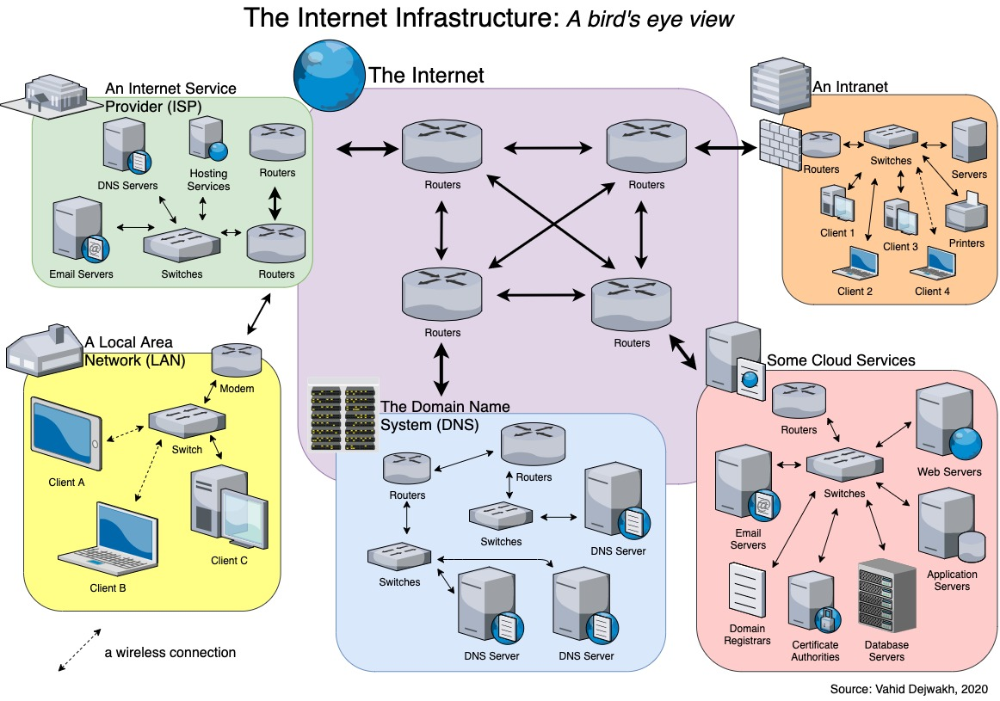
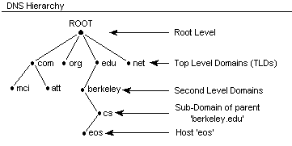

# Лабораторная работа 6. Веб-программирование и работа в сети

## Содержание

- [Лабораторная работа 6. Веб-программирование и работа в сети](#лабораторная-работа-6-веб-программирование-и-работа-в-сети)
  - [Содержание](#содержание)
  - [Устройство Интернета: IP-адреса, домены](#устройство-интернета-ip-адреса-домены)
  - [HTTP/HTTPS](#httphttps)
  - [Сокеты](#сокеты)
  - [REST и RESTful API](#rest-и-restful-api)
  - [FastAPI: фреймворк для создания простых RESTful API](#fastapi-фреймворк-для-создания-простых-restful-api)
  - [MVC: модель, представление, контроллер](#mvc-модель-представление-контроллер)
  - [Postman](#postman)
  - [Задание](#задание)

## Устройство Интернета: IP-адреса, домены

**Интернет** - это глобальная сеть, которая соединяет миллионы частных, государственных, учебных и бизнес-компьютеров по всему миру. Он состоит из множества сетей, которые используют стандартные протоколы для связи друг с другом. Из-за своей глобальной природы Интернет не имеет единой точки управления, и его структура децентрализована, что требует наличия стандартов и протоколов для обеспечения совместимости между различными системами.

На наиболее базовом уровне Интернет состоит из физических соединений между компьютерами, которые могут быть реализованы с помощью различных технологий, таких как оптоволокно, медные кабели и беспроводные сети. Эти соединения образуют **локальные сети** (Local Address Network - LAN), которые затем соединяются друг с другом через специальные устройства маршрутизаторы и коммутаторы, образуя более крупные сети.



Чтобы компьютеры могли находить друг друга в этой сложной сети, каждому устройству в Интернете присваивается уникальный **IP-адрес** (Internet Protocol Address) - числовой идентификатор, который позволяет устройствам обмениваться данными друг с другом. Существует два основных типа IP-адресов: IPv4 и IPv6. IPv4 - это 32-битный адрес формата xxx.xxx.xxx.xxx, где xxx - число от 0 до 255, который может представлять около 4 миллиардов уникальных адресов, тогда как IPv6 - это 128-битный адрес в шестнадцатеричном формате, который может представлять гораздо большее количество уникальных адресов.

Одной из проблем, связанных с использованием IP-адресов, является то, что они трудны для запоминания людьми. Для упрощения доступа к веб-сайтам и другим ресурсам в Интернете, была разработана **система доменных имен** (Domain Name System - DNS), которая позволяет использовать более удобные для восприятия имена вместо числовых адресов.

Например, вместо того чтобы запоминать IP-адрес веб-сайта, вы можете просто ввести его доменное имя, такое как *<www.google.com>* или *<www.yandex.ru>*. DNS работает как телефонная книга для Интернета, сопоставляя доменные имена с соответствующими IP-адресами. Когда вы вводите доменное имя в адресной строке браузера, ваш компьютер отправляет запрос на сервер DNS, который возвращает соответствующий IP-адрес, позволяя вашему компьютеру подключиться к нужному ресурсу. При расшифровке доменных имен в IP-адреса имена читаются справа налево, начиная с самого последнего уровня. Например, в доменном имени *<www.yandex.ru>*:

- **ru** - это домен верхнего уровня (TLD), который указывает на страну или организацию, к которой принадлежит сайт.
- **yandex** - это второй уровень домена, который указывает на конкретный сайт или организацию.
- **www** - это поддомен, который указывает на конкретный сервер или службу внутри домена.



Таким образом, полное доменное имя *<www.yandex.ru>* указывает на веб-сервер Yandex в России. Система доменных имен позволяет легко находить и идентифицировать ресурсы в Интернете, делая его более доступным для пользователей.

## HTTP/HTTPS

**HTTP (Hyper-Text Transfer Protocol)** - это протокол передачи данных, который используется для обмена информацией между клиентом и сервером в Интернете. Он определяет правила и форматы, которые должны соблюдаться при передаче данных, чтобы обеспечить корректное взаимодействие между различными системами.

HTTP работает по принципу клиент-серверной архитектуры, где клиент (обычно веб-браузер) отправляет запросы на сервер, который обрабатывает эти запросы и возвращает ответы. Запросы и ответы передаются в виде текстовых сообщений, которые содержат **заголовки** и **тело сообщения**. Допустим, нужно отправить запрос на получение веб-страницы <www.google.com>. В этом случае клиент отправляет HTTP-запрос, который может выглядеть следующим образом:

```http
GET / HTTP/1.1
Host: www.google.com
```

В этом запросе:

- `GET` - это метод HTTP, который указывает на то, что клиент хочет получить ресурс (в данном случае веб-страницу).
- `/` - это путь к ресурсу на сервере (в данном случае корневая страница).
- `HTTP/1.1` - это версия протокола HTTP, которую использует клиент.
- `Host: www.google.com` - это заголовок, который указывает на доменное имя сервера, к которому клиент обращается.
Сервер обрабатывает этот запрос и отправляет ответ, который может выглядеть следующим образом:

```http
HTTP/1.1 200 OK
Content-Type: text/html; charset=UTF-8
<!DOCTYPE html>
...
<html>
<head>
    <title>Google</title>
</head>
<body>
    <h1>Welcome to Google!</h1>
    ...
</body>
</html>
```

В этом ответе:

- `HTTP/1.1 200 OK` - это статусный код, который указывает на то, что запрос был успешно обработан (код 200 означает "OK").
- `Content-Type: text/html; charset=UTF-8` - это заголовок, который указывает на тип содержимого, которое возвращает сервер (в данном случае HTML-страница с кодировкой UTF-8).
- Тело ответа содержит HTML-код веб-страницы, которую клиент запрашивал.

HTTP поддерживает различные методы, которые определяют тип операции, которую клиент хочет выполнить. Наиболее распространенные методы включают:

- `GET` - запрашивает ресурс с сервера.
- `POST` - отправляет данные на сервер для создания нового ресурса.
- `PUT` - обновляет существующий ресурс на сервере.
- `DELETE` - удаляет ресурс с сервера.

В Python HTTP-запросы можно отправлять с помощью библиотеки `requests`, которая предоставляет простой и удобный интерфейс для работы с HTTP. Например, чтобы отправить GET-запрос на получение веб-страницы, можно использовать следующий код:

```python
import requests

response = requests.get('https://www.google.com')

print(response.status_code, response.reason, end='\n\n')
print(response.headers, end='\n\n')
print(response.text)
```

Библиотека поддерживает все основные методы HTTP и позволяет легко отправлять запросы, обрабатывать ответы и работать с заголовками. Например, чтобы отправить POST-запрос с данными в формате JSON, можно использовать следующий код:

```python
import requests
import json
url = 'https://api.example.com/resource'
data = {'key': 'value'}
response = requests.post(url, json=data)
print(response.status_code, response.reason, end='\n\n')
print(response.headers, end='\n\n')
print(response.json())
```

## Сокеты

**Сокеты** - это программные интерфейсы, которые позволяют приложениям обмениваться данными по сети как внутри одного компьютера, так и в рамках Интернета. Они обеспечивают механизм для установления соединения между двумя компьютерами и передачи данных между ними. Сокеты могут использоваться для создания клиент-серверных приложений, где один компьютер (клиент) отправляет запросы на другой компьютер (сервер), который обрабатывает эти запросы и отправляет ответы обратно.

В Python сокеты реализованы в модуле `socket`, который предоставляет функции для создания, настройки и управления сокетами. Простейший сокет выглядит следующим образом:

## REST и RESTful API

**REST (Representational State Transfer)**- это архитектурный стиль, который используется для создания веб-сервисов и API. Он основан на принципах HTTP и использует стандартные методы HTTP (GET, POST, PUT, DELETE и т.д.) для выполнения операций над ресурсами.

Сервисы, которые соответствуют , называются **RESTful API**. RESTful API позволяет клиентам взаимодействовать с сервером через простые и понятные URL-адреса, что делает его удобным для использования в веб-приложениях.

RESTful API имеет важное характеристики, которые отличают его от других архитектурных стилей:

1. **Клиент-серверная архитектура**: RESTful API разделяет клиентскую и серверную части, что позволяет им развиваться независимо друг от друга. Клиент может быть любым устройством, которое может отправлять HTTP-запросы, а сервер - это приложение, которое обрабатывает эти запросы и возвращает ответы.
2. **Идентификация ресурсов**: Каждый *ресурс* (все, что требуется отобразить через запрос) в RESTful API имеет уникальный URL-адрес, который позволяет клиентам получать доступ к этому ресурсу. Например, URL-адрес *<https://api.example.com/users/123>* может представлять пользователя с идентификатором 123.
3. **Статусные коды**: RESTful API использует стандартные HTTP статусные коды для обозначения результата выполнения запроса. Например, код 200 (OK) указывает на успешное выполнение запроса, а код 404 (Not Found) указывает на то, что запрашиваемый ресурс не найден. Полный список кодов можно найти в [документации команды Mozilla](https://developer.mozilla.org/ru/docs/Web/HTTP/Status).
4. **Stateless**: Каждый запрос к RESTful API должен содержать всю необходимую информацию для его обработки. Сервер не хранит состояние между запросами, что позволяет масштабировать API и упрощает его использование.
5. **Кэширование**: RESTful API поддерживает кэширование ответов, что позволяет уменьшить нагрузку на сервер и ускорить время отклика. Кэширование может быть реализовано с помощью HTTP-заголовков, таких как *Cache-Control* и *Expires*.
6. **Унифицированный интерфейс**: RESTful API использует стандартные методы HTTP (GET, POST, PUT, DELETE и т.д.) для выполнения операций над ресурсами. Это позволяет клиентам легко взаимодействовать с API, не требуя дополнительных библиотек или инструментов.
7. **Многообразие форматов**: RESTful API может использовать различные форматы данных для обмена информацией, такие как JSON, XML и HTML. JSON является наиболее распространенным форматом, так как он легковесен и легко читаем.
8. **Гипермедиа**: RESTful API может использовать гипермедиа для предоставления информации о доступных ресурсах и действиях, которые могут быть выполнены с ними. Это позволяет клиентам динамически обнаруживать и взаимодействовать с API, не полагаясь на заранее определенные URL-адреса.
9. **Безопасность**: RESTful API может использовать различные механизмы безопасности, такие как аутентификация и авторизация, для защиты ресурсов и обеспечения доступа только к авторизованным пользователям. Наиболее распространенными методами аутентификации являются Basic Auth, OAuth и JWT (JSON Web Token).
10. **Версионирование**: RESTful API может использовать версионирование для управления изменениями в API и обеспечения обратной совместимости. Версионирование может быть реализовано с помощью URL-адресов (например, *<https://api.example.com/v1/users>*), заголовков или параметров запроса.
11. **Документация**: RESTful API должен иметь четкую и понятную документацию, которая описывает доступные ресурсы, методы, параметры и примеры использования. Это позволяет разработчикам легко интегрировать API в свои приложения и понимать, как им пользоваться.
12. **Тестирование**: RESTful API должен быть протестирован на корректность и производительность. Это включает в себя тестирование всех доступных методов, проверку обработки ошибок и тестирование производительности при высокой нагрузке.
13. **Мониторинг**: RESTful API должен быть мониторирован для отслеживания его производительности, доступности и использования. Это позволяет выявлять проблемы и оптимизировать API для улучшения его работы.

## FastAPI: фреймворк для создания простых RESTful API

**FastAPI** - это современный веб-фреймворк для создания RESTful API на Python. Он основан на стандартном Python-стеке и использует асинхронные функции для обработки запросов, что позволяет ему быть быстрым и эффективным. FastAPI поддерживает автоматическую генерацию документации API с помощью OpenAPI и JSON Schema, что упрощает разработку и тестирование API.
FastAPI также поддерживает валидацию данных с помощью Pydantic, что позволяет легко проверять входные данные и генерировать ошибки при неправильном формате. Он также поддерживает различные механизмы аутентификации и авторизации, такие как OAuth2 и JWT, что позволяет защищать API и управлять доступом к ресурсам.

FastAPI позволяет легко создавать RESTful API с помощью простого и понятного синтаксиса. Чтобы создать простой API с одним маршрутом, который возвращает "Hello, World!", можно использовать следующий код:

```python
from fastapi import FastAPI

app = FastAPI()

@app.get("/")
async def root():
    return {"message": "Hello World"}
```

Здесь:

- `FastAPI` - это основной класс, который представляет приложение. Он будет обрабатывать все запросы и маршруты, заданные приложением.

Важные особенности FastAPI:

- **Асинхронность**: FastAPI поддерживает асинхронные функции, что позволяет обрабатывать запросы параллельно и повышает производительность приложения.
- **Автоматическая документация**: FastAPI автоматически генерирует документацию API с помощью OpenAPI и Swagger, что позволяет легко тестировать и использовать API.
- **Валидация данных**: FastAPI использует Pydantic для валидации входных данных, что позволяет легко проверять и обрабатывать данные.

## MVC: модель, представление, контроллер

**MVC (Model-View-Controller)** - это архитектурный шаблон, который используется для организации кода в веб-приложениях. Он разделяет приложение на три основные компонента:

1. **Model (Модель)**: отвечает за управление данными и бизнес-логикой приложения. Она взаимодействует с базой данных и выполняет операции над данными, такие как создание, чтение, обновление и удаление (CRUD). Модель также может содержать валидацию данных и правила бизнес-логики.
2. **View (Представление)**: отвечает за отображение данных пользователю. Она получает данные из модели и формирует их в удобный для восприятия формат, такой как HTML, JSON или XML. Представление также может содержать логику для обработки пользовательского ввода и взаимодействия с моделью.
3. **Controller (Контроллер)**: отвечает за обработку пользовательских запросов и управление взаимодействием между моделью и представлением. Он получает запросы от пользователя, вызывает соответствующие методы модели для обработки данных и передает результаты в представление для отображения.

Как это можно реализовать? 

## Postman

## Задание
